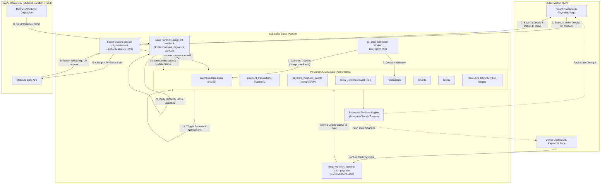
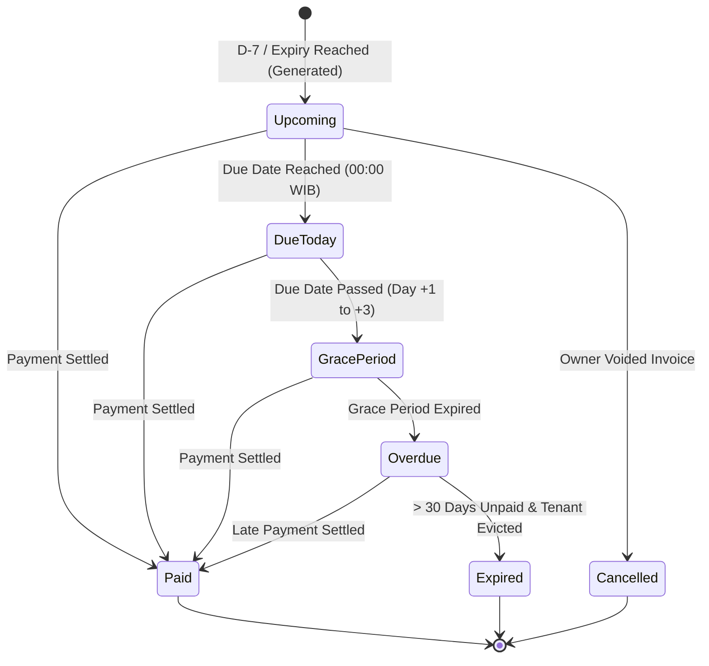
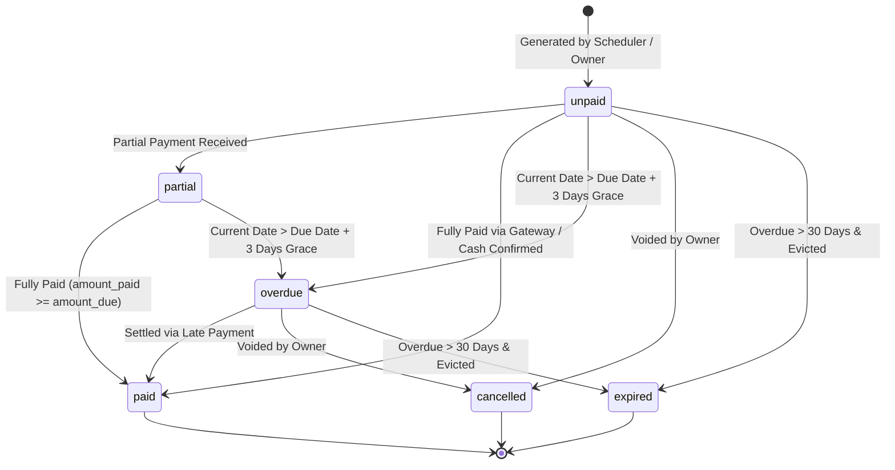
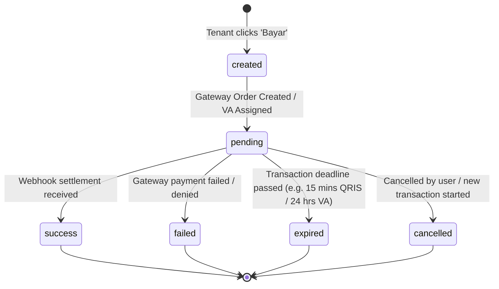
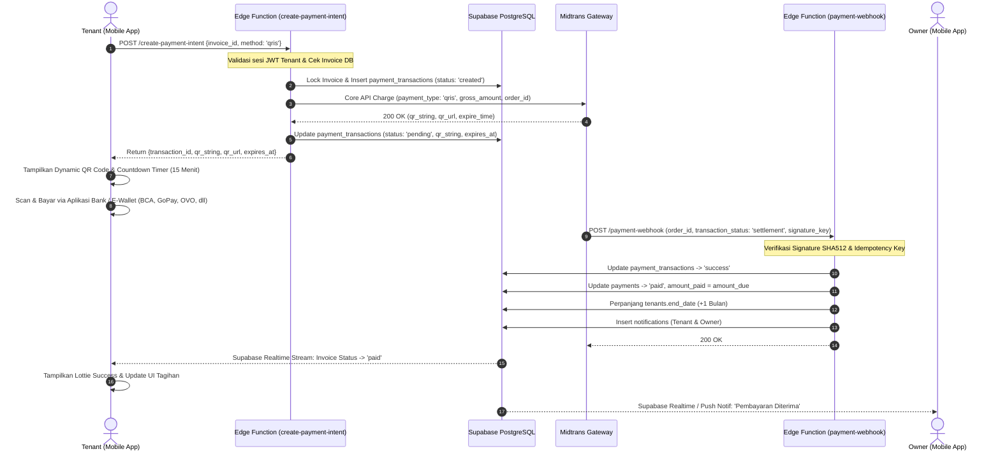
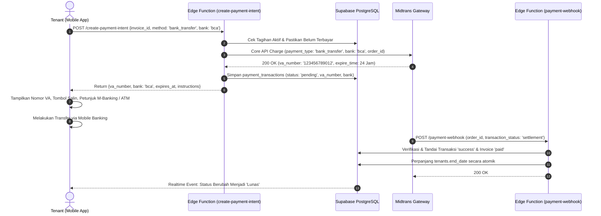
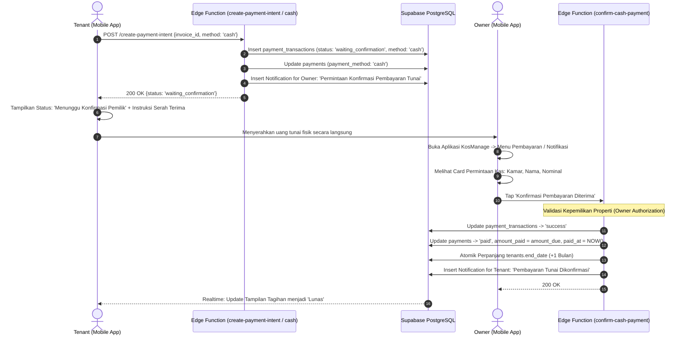
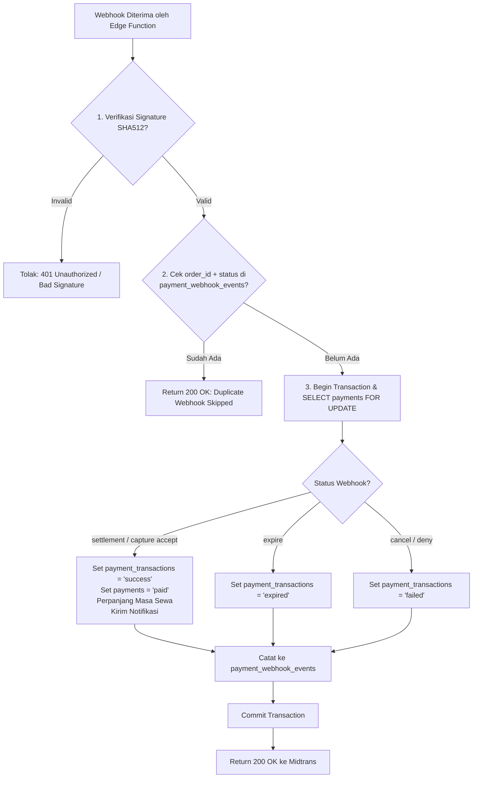

# PRD & SYSTEM ARCHITECTURE: END-TO-END AUTOMATIC BILLING & PAYMENT SYSTEM
**KosManage Mobile (Flutter + Supabase PostgreSQL + Edge Functions + Payment Gateway)**

- **Document Version:** 1.0.0 (Production Architecture Draft)
- **Status:** Approved for Implementation Planning
- **Author:** Senior Product Manager, Payment System Architect & Supabase Lead
- **Target Platform:** Android & iOS (Flutter Client), Supabase (PostgreSQL, Auth, Storage, Edge Functions, pg_cron)
- **Document Path:** `docs/PRD-PAYMENT-BILLING.md`

---

## 1. Product Overview

KosManage Mobile adalah aplikasi pengelolaan operasional rumah kos yang melayani dua persona utama: **Owner (Pemilik Kos)** dan **Tenant (Penghuni Kos)**. Salah satu friksi terbesar dalam operasional kos adalah proses penagihan sewa bulanan dan rekonsiliasi pembayaran. Saat ini, penagihan masih dilakukan secara manual melalui komunikasi chat, pencatatan manual oleh pemilik, dan pembayaran tenant dilakukan secara off-platform tanpa verifikasi otomatis.

Sistem Pembayaran dan Penagihan Otomatis (**Automatic Billing & Multi-Channel Payment System**) ini dirancang untuk mengubah KosManage menjadi platform manajemen properti mandiri (*self-driving property management*). Sistem ini mengotomasi seluruh siklus hidup penagihan:
1. Mendeteksi masa sewa yang akan berakhir secara terjadwal di level cloud backend (*server-side automatic billing*).
2. Menerbitkan invoice penagihan baru secara idempoten tanpa intervensi manusia.
3. Mengirimkan notifikasi tagihan secara instan ke tenant (*in-app, realtime, push notification*).
4. Menyediakan metode pembayaran multi-channel modern yang aman (QRIS Dinamis, Transfer Bank / Virtual Account, dan Pembayaran Tunai / Cash).
5. Memverifikasi pembayaran secara *authoritative* melalui webhook payment gateway berkeamanan tinggi dengan verifikasi tanda tangan kriptografis (*signature verification*).
6. Memperpanjang masa sewa (*rental renewal*) secara atomik tanpa risiko perpanjangan ganda (*double renewal*).
7. Menyediakan konfirmasi satu pintu bagi pemilik untuk pembayaran tunai.

---

## 2. Problem Statement

Pengelolaan sewa kos konvensional dan arsitektur MVP KosManage saat ini memiliki sejumlah kelemahan struktural:
1. **Human Dependency & Forgetfulness:** Pemilik kos sering lupa menagih saat masa sewa tenant habis, menyebabkan tunggakan akumulatif dan penurunan *cashflow*.
2. **Client-Side Vulnerability:** Sistem lama mencatat pembayaran secara manual melalui form input pemilik (`OwnerPaymentsRepository`), sementara tenant hanya memiliki akses *read-only* tanpa kemampuan membayar langsung di aplikasi.
3. **No Authoritative Settlement:** Tidak ada mekanisme verifikasi transaksi independen. Bukti transfer bank konvensional rawan dipalsukan (*fake receipt scam*).
4. **App-Dependent Processes:** Sistem yang mengandalkan trigger client-side Flutter tidak akan berjalan jika aplikasi ditutup, smartphone kehabisan baterai, atau offline.
5. **Reconciliation Overhead:** Pemilik kos dengan puluhan kamar harus memeriksa mutasi rekening bank secara manual satu per satu untuk mencocokkan nominal transfer dengan nama penghuni.
6. **Cash Transparency Issue:** Pembayaran tunai rentan terhadap salah catat dan perselisihan jika tidak ada bukti serah terima digital yang mengikat kedua belah pihak.

---

## 3. Goals

### 3.1 Business Goals
- **Otomasi 100% Pembuatan Tagihan:** Menghilangkan proses manual pembuatan invoice bulanan untuk seluruh tenant aktif.
- **Peningkatan On-Time Payment Rate:** Mengurangi tunggakan sewa hingga >70% melalui reminder tagihan terotomasi dan kemudahan pembayaran instan via QRIS/VA.
- **Zero Reconciliation Leakage:** 100% pembayaran digital diverifikasi dan direkonsiliasi otomatis oleh server gateway tanpa intervensi manual.
- **Transparansi Finansial:** Memberikan visibilitas status sewa dan riwayat transaksi secara *realtime* baik bagi owner maupun tenant.

### 3.2 Technical & Architectural Goals
- **Server Authoritative:** Backend PostgreSQL dan Supabase Edge Functions adalah sumber kebenaran tunggal (*single source of truth*) untuk nominal, status, dan masa sewa. Client Flutter dilarang menentukan status lunas atau nominal tagihan.
- **Strict Idempotency:** Menjamin tidak ada pembuatan invoice ganda, tidak ada transaksi duplikat pada gateway, tidak ada penyelesaian ganda (*anti-double settlement*), dan tidak ada perpanjangan masa sewa ganda (*anti-double renewal*).
- **Zero Trust Security:** Kredensial rahasia gateway (*Server Key*) hanya disimpan di Supabase Vault / Edge Function environment. Tidak ada *secret* yang terpapar ke repositori Git ataupun *mobile binary*.
- **Role-Based Row Level Security (RLS):** Isolasi multi-tenant yang ketat; tenant hanya dapat melihat datanya sendiri, dan owner hanya dapat melihat properti miliknya.
- **High Compatibility & Zero Breaking Changes:** Tidak merusak alur modul kamar, penghuni, laporan keuangan, dan dashboard owner yang sudah berjalan di KosManage Mobile.

---

## 4. Non-Goals

Fitur-fitur berikut secara eksplisit **di luar cakupan** fase ini untuk menjaga fokus dan stabilitas:
- **Direct Credit/Debit Card Tokenization / 3DS Client Form:** Pembayaran kartu kredit langsung di aplikasi tidak disertakan (hanya QRIS dan Bank Transfer VA).
- **Split Payment / Escrow Multi-Rekening Otomatis:** Dana pembayaran langsung diteruskan ke rekening merchant pemilik kos via gateway tanpa *escrow holding* kompleks antar sub-rekening.
- **Pajak/Tax Engine Dinamis:** Pajak pertambahan nilai (PPN) atau potongan pajak penghasilan daerah tidak dihitung dinamis; nominal sewa mengikuti master `rent_price` kamar/penghuni.
- **Auto-Debit Rekening Bank / Subscription Recurring Charge:** Tidak melakukan debit otomatis rekening tabungan tenant tanpa otorisasi manual setiap bulan.
- **Peminjaman Dana / PayLater:** KosManage tidak menyediakan fasilitas pembiayaan talangan sewa.

---

## 5. Actors & Permissions

| Aktor | Peran & Tanggung Jawab | Hak Akses Utama | Larangan Akses |
|---|---|---|---|
| **Tenant (Penghuni)** | Penyewa kamar kos aktif. Menerima tagihan, memilih metode pembayaran, melakukan transfer/scan, melihat riwayat. | - Read tagihan miliknya.<br>- Read detail kamar & kos miliknya.<br>- Create *Payment Intent* atas tagihan aktif.<br>- Read instruksi bayar & status transaksi miliknya.<br>- Read notifikasi personal. | - Mengubah nominal tagihan (`amount_due`).<br>- Mengubah status pembayaran menjadi `paid`.<br>- Mengonfirmasi sendiri pembayaran Cash.<br>- Mengakses tagihan/transaksi penghuni lain.<br>- Mengubah data properti/kamar. |
| **Owner (Pemilik Kos)** | Pengelola properti kos. Memantau keuangan, memeriksa pembayaran, mengonfirmasi pembayaran tunai, mengatur sewa. | - Read seluruh tagihan properti miliknya.<br>- Read riwayat transaksi & audit log properti.<br>- Update / Confirm pembayaran Cash (Waiting Confirmation).<br>- Catat tagihan/pembayaran manual jika diperlukan.<br>- Cancel tagihan yang tidak valid. | - Melihat data properti/transaksi milik owner lain.<br>- Memanipulasi *signature* transaksi payment gateway.<br>- Mengubah riwayat transaksi gateway yang sudah berstatus `success`. |
| **System Scheduler (pg_cron / Worker)** | Daemon terjadwal di Supabase cloud. Mengeksekusi pembuatan invoice berkala dan pembaruan status overdue. | - Service-Role internal execution.<br>- Batch insert invoice idempoten.<br>- Batch update status invoice overdue.<br>- Trigger notifikasi tagihan baru. | - Tidak dapat dipanggil sembarangan dari publik (dilindungi internal database security). |
| **Payment Gateway Webhook (Midtrans)** | Server eksternal pihak ketiga yang mengirimkan notifikasi status transaksi. | - Mengirimkan payload HTTP POST status transaksi ke Edge Function `/payment-webhook`. | - Ditolak jika signature hash HMAC/SHA512 tidak valid. Tidak memiliki akses langsung ke database. |

---

## 6. Existing System Analysis

### 6.1 Analisis Struktur Database dan Repositori Saat Ini

Berdasarkan audit mendalam terhadap basis kode aktif KosManage Mobile:

1. **Model `OwnerPayment` (`lib/domain/models/owner_management.dart`):**
   - Merepresentasikan row tabel `payments`.
   - Field: `id`, `billingPeriod`, `dueDate`, `amountDue`, `amountPaid`, `status`, `tenantId`, `tenantName`, `roomNumber`, `paymentDate`, `paymentMethod`, `paymentReference`, `paymentUrl`, `paidAt`, `notes`.
   - Getter `remaining` dihitung dari `amountDue - amountPaid`.
   - Status yang didukung saat ini: `unpaid`, `partial`, `paid`, `overdue`.

2. **Fungsi Database Authoritative (`supabase/migrations_proposed/20261005_pin_function_search_path.sql`):**
   - Terdapat fungsi immutable `public.compute_payment_status(amount_due, amount_paid, due_date, as_of)`.
   - Terdapat trigger `public.payments_set_status()` pada tabel `payments` yang secara otomatis menetapkan status:
     - `p_amount_paid >= p_amount_due` $\rightarrow$ `'paid'`
     - `p_as_of > p_due_date` $\rightarrow$ `'overdue'`
     - `p_amount_paid > 0` $\rightarrow$ `'partial'`
     - Else $\rightarrow$ `'unpaid'`

3. **Status Akses Tenant Saat Ini (`lib/features/tenant/presentation/tenant_shell_page.dart`):**
   - Terdapat komentar eksplisit: `// ponytail: read-only tenant bills; payment writes stay owner-only.`
   - Tab Tagihan hanya menampilkan list tagihan dari `getMyPayments(...)` tanpa tombol aksi pembayaran interaktif.

4. **Kelemahan Arsitektur Tabel Tunggal `payments` Saat Ini:**
   - Tabel `payments` saat ini mencampuradukkan konsep **Invoice (Kewajiban Tagihan)** dengan **Transaction Attempt (Upaya Bayar)**.
   - Jika tenant mencoba bayar via QRIS (gagal/expired), lalu mencoba via BCA VA, lalu beralih ke Cash: field `payment_method`, `payment_reference`, dan `payment_url` akan tertimpa dan riwayat percobaan sebelumnya hilang.
   - Tidak mendukung penyimpanan metadata payment gateway yang kaya (misal: nomor VA, bank, expiry QRIS, raw payload webhook, signature hash) secara terstruktur.

### 6.2 Keputusan Desain: Ekstensi Skema vs Entitas Terpisah

**Keputusan Arsitektur:** **Pemisahan Entitas Relasional dengan Backward Compatibility Layer**.

Kita **TIDAK MENGGANTI ATAU MENGHAPUS** tabel `payments`, melainkan:
1. **Mempertahankan tabel `payments` sebagai entitas canonical Invoice (`invoices`)**: Menambahkan kolom metadata yang diperlukan (`invoice_number`, `period_start`, `period_end`, `grace_period_days`, `renewal_applied_at`, `is_renewal`). Dengan demikian, **100% kode query owner dan laporan keuangan yang sudah ada tidak ada yang rusak**.
2. **Membuat tabel anak `payment_transactions`**: Menampung relasi $1 \text{ Invoice} : N \text{ Transactions}$ untuk mencatat setiap kali tenant membuat *payment intent* (QRIS, VA, Cash) lengkap dengan status, payload gateway, expiry, dan referensi transaksi unik.
3. **Membuat tabel pendukung:**
   - `payment_webhook_events`: Untuk mencatat log webhook masuk dan memastikan idempotensi (*anti-replay attack*).
   - `rental_renewals`: Catatan audit log perpanjangan kontrak sewa.
   - `notifications`: In-app notification log untuk owner dan tenant.
   - `device_tokens`: Menyimpan FCM/APNS token untuk push notification.

---

## 7. Payment Architecture

### 7.1 Diagram Arsitektur Tingkat Tinggi



### 7.2 Komponen Arsitektur Utama
1. **Edge Function `create-payment-intent`:**
   - Menerima `invoice_id` dan `payment_method` dari client Flutter yang sudah login.
   - Menghitung ulang nominal secara otoritatif dari database (mengabaikan input nominal client).
   - Memeriksa apakah ada transaksi aktif yang belum kedaluwarsa.
   - Memanggil API Midtrans menggunakan `MIDTRANS_SERVER_KEY` yang aman.
   - Mengembalikan data pembayaran (URL QRIS / QR String, Nomor VA, batas waktu bayar).
2. **Edge Function `payment-webhook`:**
   - Menerima callback status dari Midtrans.
   - Melakukan verifikasi signature `SHA-512(order_id + status_code + gross_amount + ServerKey)`.
   - Menggunakan locking transaksi database (`FOR UPDATE`) dan tabel `payment_webhook_events` agar payload yang sama tidak pernah diproses dua kali.
   - Mengubah status transaksi dan invoice menjadi `paid`.
   - Memanggil fungsi pembaruan sewa otomatis.
3. **Edge Function `confirm-cash-payment`:**
   - Dikhususkan untuk owner memverifikasi pembayaran tunai.
   - Memastikan pemanggil adalah pemilik sah dari properti yang menaungi kamar terkait.

---

## 8. Billing Lifecycle

Siklus penagihan dirancang secara teratur mengikuti kalender bulanan atau periode sewa penghuni:



### 8.1 Definisi Timeline Penagihan
- **Generation Date ($T_{gen}$):** Waktu invoice diterbitkan. Ditetapkan secara otomatis oleh scheduler pada saat masa sewa periode berjalan selesai (`end_date`) atau secara opsi lanjutan $D-7$ sebelum sewa berakhir.
- **Period Start ($P_{start}$):** Tanggal awal masa sewa baru (contoh: jika sewa lama berakhir `2026-10-31`, maka $P_{start} = \text{2026-11-01}$).
- **Period End ($P_{end}$):** Tanggal akhir masa sewa baru ($P_{start} + 1 \text{ bulan} - 1 \text{ hari}$, contoh: `2026-11-30`).
- **Due Date ($D_{due}$):** Tanggal jatuh tempo pembayaran. Default: sama dengan $P_{start}$ (misal `2026-11-01`).
- **Grace Period:** Masa tenggang toleransi sebelum dikenakan status tunggakan (*overdue*). Ditetapkan **3 hari kalender** setelah $D_{due}$.
- **Overdue Transition:** Hari ke-4 setelah $D_{due}$ pukul 00:01 WIB, jika `amount_paid < amount_due`, status invoice berubah menjadi `overdue`.
- **Expired Transition:** Jika tagihan tidak dibayar melebihi 30 hari kalender dan tenant dinyatakan checkout/batal oleh owner, invoice dapat ditandai `expired` atau `cancelled`.

---

## 9. Rental Expiration Rule

### 9.1 Status Masa Sewa Tenant vs Status Tagihan
Masa sewa tenant dicatat pada tabel `tenants`:
- `start_date`: Tanggal awal sewa pertama kali menghuni.
- `end_date`: Tanggal akhir hak huni kamar yang berlaku saat ini.
- `status`: `'active'`, `'inactive'`.

Sistem menghitung sisa hari secara dinamis via pure service `rentalCountdown(endDate)`:
- $> 30$ hari: **Normal** (Aman)
- $15 - 30$ hari: **Perhatian**
- $7 - 14$ hari: **Segera Berakhir**
- $1 - 6$ hari: **Sangat Dekat**
- $0$ hari: **Berakhir Hari Ini**
- $< 0$ hari: **Lewat Masa Sewa (Past Due)**

### 9.2 Aturan Perpanjangan Sewa
1. Sewa **hanya boleh diperpanjang** apabila invoice penagihan periode berikutnya telah lunas (`status = 'paid'`).
2. Perpanjangan masa sewa dilakukan dengan memperbarui `tenants.end_date`:
   $$\text{new\_end\_date} = \text{old\_end\_date} + 1 \text{ bulan}$$
   *(Menggunakan fungsi PostgreSQL `(old_end_date + INTERVAL '1 month')::date` untuk akurasi durasi hari tiap bulan).*
3. Jika tenant membayar terlambat (saat status sudah *overdue* atau *past due*), penghitungan perpanjangan tetap berbasis pada tanggal akhir kontrak sebelumnya agar tidak terjadi pergeseran tanggal sewa gratis (*no free-rent gap*).

---

## 10. Automatic Invoice Generation

### 10.1 Mekanisme Scheduler Server-Side
Otomasi penagihan diwujudkan melalui **Supabase pg_cron** yang mengeksekusi Stored Procedure PostgreSQL `public.generate_recurring_invoices()` setiap hari pada pukul **00:05 WIB (17:05 UTC)**.

```sql
-- Pendaftaran pg_cron Job di Supabase
SELECT cron.schedule(
  'daily-automatic-billing-job',
  '5 17 * * *', -- Setiap hari jam 00:05 WIB (17:05 UTC)
  $$ SELECT public.generate_recurring_invoices(); $$
);
```

### 10.2 Algoritma Stored Procedure Idempoten

```mermaid
flowchart TD
    START([Start Scheduler: 00:05 WIB]) --> QUERY[Query tenants aktif yang end_date <= current_date]
    QUERY --> LOOP{Loop setiap Tenant}
    
    LOOP --> CHECK{Apakah sudah ada invoice<br>untuk billing_period berikutnya?}
    CHECK -- Ya --> SKIP[Lewati / Log Skip]
    CHECK -- Tidak --> LOCK[Acquire Advisory Lock per Tenant]
    
    LOCK --> CALC[Hitung period_start, period_end, due_date]
    CALC --> CREATE_INV[Insert ke tabel payments<br>dengan ON CONFLICT DO NOTHING]
    CREATE_INV --> CREATE_NOTIF[Insert ke tabel notifications<br>Event: invoice_created]
    CREATE_NOTIF --> UNLOCK[Release Lock]
    
    SKIP --> NEXT{Masih ada tenant?}
    UNLOCK --> NEXT
    NEXT -- Ya --> LOOP
    NEXT -- Tidak --> OVERDUE_JOB[Jalankan public.update_overdue_invoices()]
    OVERDUE_JOB --> END([Finish Scheduler Job])
```

### 10.3 Jaminan Idempotensi Pembuatan Invoice
1. **Database Unique Constraint:**
   Dibuat constraint unik pada tabel `payments`:
   `CONSTRAINT uq_payments_tenant_billing_period UNIQUE (tenant_id, billing_period)`
   Hal ini menjamin pada tingkat PostgreSQL bahwa untuk tenant X dan periode Y, hanya ada tepat satu baris tagihan.
2. **Klausul SQL Defensif:**
   Query insert menggunakan:
   `INSERT INTO payments (...) VALUES (...) ON CONFLICT (tenant_id, billing_period) DO NOTHING;`
3. **Penamaan Billing Period Standar:**
   Format string periode dibakukan menjadi `YYYY-MM` (contoh: `2026-11`).

---

## 11. Invoice State Machine

### 11.1 Diagram Status Invoice (`payments.status`)



### 11.2 Tabel Transisi Status Invoice

| Dari Status | Menuju Status | Kondisi Pemicu | Aktor Berwenang | Catatan Integritas |
|---|---|---|---|---|
| `-` | `unpaid` | Tagihan otomatis dibuat oleh `pg_cron` atau dibuat manual oleh owner. | Scheduler / Owner | Default awal setiap invoice. |
| `unpaid` / `partial` | `overdue` | Tanggal saat ini melebihi `due_date + grace_period` dan `amount_paid < amount_due`. | Scheduler Cron Daily | Ditandai otomatis oleh database cron. |
| `unpaid` / `overdue` / `partial` | `paid` | Webhook gateway terverifikasi atau Owner menyetujui pembayaran tunai. | Edge Function Webhook / Owner | `amount_paid` menjadi sama dengan `amount_due`. `paid_at` diisi timestamp saat itu. |
| `unpaid` | `partial` | Pembayaran tunai bertahap dicatat oleh owner. | Owner | Hanya berlaku jika pembayaran cicilan diizinkan owner. |
| `unpaid` / `overdue` | `cancelled` | Tenant membatalkan kontrak sewa secara resmi sebelum masa sewa dimulai. | Owner | Tagihan dihapus dari kewajiban tenant. |
| `overdue` | `expired` | Tenant menunggak lama dan meninggalkan kos tanpa pelunasan. | Owner / System | Tagihan diarsipkan sebagai piutang tak tertagih. |

---

## 12. Payment Transaction State Machine

Setiap upaya pembayaran (*payment attempt*) dicatat di tabel `payment_transactions`.

### 12.1 Diagram Status Transaksi



### 12.2 Aturan Transisi Transaksi
- **Created:** Client meminta *payment intent*. Record dibuat di tabel `payment_transactions`.
- **Pending:** Gateway berhasil membalas dengan payload QRIS / VA. Client menampilkan instruksi bayar.
- **Success:** Webhook Midtrans berstatus `settlement` atau `capture` (dengan status `accept`) diterima dan diverifikasi.
- **Expired:** Midtrans mengirimkan notifikasi `expire` atau waktu lokal transaksi melewati `expires_at`.
- **Cancelled:** Tenant membatalkan transaksi atau membuat metode pembayaran baru (transaksi aktif sebelumnya otomatis ditandai `cancelled`).

---

## 13. QRIS Flow



---

## 14. Bank Transfer / Virtual Account Flow



---

## 15. Cash Flow

Metode pembayaran tunai mengakomodasi tenant yang tidak memiliki rekening bank atau memilih serah terima langsung dengan pemilik kos.



---

## 16. Payment Gateway Abstraction

Arsitektur gateway dirancang dengan pola *Adapter Pattern* / *Dependency Inversion* agar business logic backend tidak terikat kaku (*vendor lock-in*) pada Midtrans.

### 16.1 Antarmuka Kontrak Gateway (TypeScript / Deno di Edge Function)

```typescript
// /supabase/functions/_shared/payment-provider.ts

export interface CreatePaymentParams {
  orderId: string;
  grossAmount: number;
  customerDetails: {
    firstName: string;
    email: string;
    phone?: string;
  };
  itemDetails: Array<{
    id: string;
    price: number;
    quantity: number;
    name: string;
  }>;
  customExpiryMinutes?: number;
}

export interface QrPaymentResult {
  provider: string;
  transactionId: string;
  qrString: string;
  qrImageUrl?: string;
  expiresAt: string;
  rawResponse: Record<string, unknown>;
}

export interface BankTransferResult {
  provider: string;
  transactionId: string;
  bank: string;
  vaNumber: string;
  expiresAt: string;
  rawResponse: Record<string, unknown>;
}

export interface WebhookVerificationResult {
  isValid: boolean;
  orderId: string;
  transactionId: string;
  transactionStatus: 'settlement' | 'pending' | 'deny' | 'cancel' | 'expire' | 'failure';
  grossAmount: number;
  paymentType: string;
  rawBody: Record<string, unknown>;
}

export interface PaymentGatewayProvider {
  name: string;
  createQrPayment(params: CreatePaymentParams): Promise<QrPaymentResult>;
  createBankTransfer(params: CreatePaymentParams, bank: 'bca' | 'bni' | 'bri' | 'mandiri' | 'permata'): Promise<BankTransferResult>;
  verifyWebhook(rawBody: Record<string, unknown>, headers: Headers): Promise<WebhookVerificationResult>;
  cancelTransaction(orderId: string): Promise<boolean>;
}
```

### 16.2 Implementasi Midtrans Provider (`MidtransPaymentProvider`)
- **QRIS:** Memanggil endpoint `/v2/charge` dengan payload `payment_type: "qris"`, parameter `acquirer: "gopay"`. Menghasilkan `qr_string` standar QRIS Nasional (EMVCo).
- **Virtual Account:** Memanggil endpoint `/v2/charge` dengan `payment_type: "bank_transfer"` dan parameter bank yang dipilih (`bca`, `bni`, `bri`, `permata`).
- **Signature Formula:**
  $$\text{Signature} = \text{SHA512}(\text{order\_id} + \text{status\_code} + \text{gross\_amount} + \text{MIDTRANS\_SERVER\_KEY})$$

---

## 17. Webhook Flow & Idempotency Engine

Webhook merupakan titik paling kritis (*high-risk endpoint*) pada sistem pembayaran. Sistem menerapkan **Triple-Guard Webhook Processing**:



### 17.1 Penanganan Webhook Datang Terlambat / Out-of-Order
Jika webhook `settlement` tiba setelah transaksi lokal ditandai `expired` (misal ada *network delay* dari gateway):
- Status invoice yang berhak mengabaikan `expired` adalah `settlement`. Database akan **mempromosikan** transaksi menjadi `success` dan invoice menjadi `paid` karena dana nyata telah diterima di rekening merchant (*financial truth takes precedence*).

---

## 18. Notification Flow

Sistem mengelola notifikasi melalui event bus internal berbasis tabel `notifications`.

### 18.1 Matriks Event Notifikasi

| Event Name | Target | Saluran | Judul Notifikasi | Isi Pesan | Deep Link Route |
|---|---|---|---|---|---|
| `invoice_created` | Tenant | In-App, Realtime, Push | Tagihan Baru Tersedia | Tagihan sewa kos periode {{period}} sebesar {{amount}} telah terbit. Jatuh tempo: {{due_date}}. | `/tenant/payments?id={{invoice_id}}` |
| `payment_reminder` | Tenant | In-App, Push | Pengingat Jatuh Tempo | Tagihan sewa kos Anda akan jatuh tempo dalam {{days_left}} hari. | `/tenant/payments?id={{invoice_id}}` |
| `payment_pending` | Tenant | In-App, Realtime | Menunggu Pembayaran | Transaksi {{method}} telah dibuat. Harap selesaikan sebelum {{expiry_time}}. | `/tenant/payments/instructions?tx_id={{tx_id}}` |
| `payment_success` | Tenant | In-App, Realtime, Push | Pembayaran Berhasil! | Terima kasih, pembayaran sewa periode {{period}} telah diterima. Masa sewa diperpanjang. | `/tenant/payments/receipt?id={{invoice_id}}` |
| `payment_success` | Owner | In-App, Realtime, Push | Pembayaran Diterima | Penghuni {{tenant_name}} (Kamar {{room_number}}) telah melunasi sewa Rp {{amount}} via {{method}}. | `/owner/payments?id={{invoice_id}}` |
| `payment_failed` | Tenant | In-App, Realtime | Pembayaran Gagal | Transaksi pembayaran Anda telah gagal atau kedaluwarsa. Silakan coba lagi. | `/tenant/payments?id={{invoice_id}}` |
| `cash_confirmation_required` | Owner | In-App, Realtime, Push | Konfirmasi Kas Masuk | {{tenant_name}} (Kamar {{room_number}}) mengajukan pembayaran tunai Rp {{amount}}. Silakan periksa uang fisik. | `/owner/payments/cash-confirm?tx_id={{tx_id}}` |
| `cash_payment_confirmed` | Tenant | In-App, Realtime, Push | Pembayaran Tunai Diterima | Pemilik kos telah mengonfirmasi penerimaan pembayaran tunai periode {{period}}. | `/tenant/payments/receipt?id={{invoice_id}}` |

---

## 19. Rental Renewal Flow

### 19.1 Logika Bisnis Perpanjangan Sewa yang Aman
Untuk mencegah risiko perpanjangan ganda (*double renewal bug*):
1. Kolom kontrol `renewal_applied_at` (TIMESTAMP WITH TIME ZONE) ditambahkan ke tabel `payments`.
2. Saat pembayaran sukses, pembaruan sewa dieksekusi melalui Stored Procedure PostgreSQL dengan pengecekan kondisi atomik:

```sql
-- Cuplikan Logika Stored Procedure: public.apply_rental_renewal(p_payment_id UUID)
UPDATE public.payments
SET renewal_applied_at = NOW()
WHERE id = p_payment_id
  AND status = 'paid'
  AND is_renewal = true
  AND renewal_applied_at IS NULL
RETURNING tenant_id, billing_period;

-- Jika tidak ada row yang ter-update, artinya perpanjangan SUDAH diaplikasikan sebelumnya!
-- Operasi STOP di sini (Idempotent Guard).
```

3. Jika lock sukses didapatkan, sistem mengeksekusi penambahan masa sewa:
```sql
UPDATE public.tenants
SET end_date = (end_date + INTERVAL '1 month')::date,
    updated_at = NOW()
WHERE id = v_tenant_id;

-- Catat riwayat ke tabel audit rental_renewals
INSERT INTO public.rental_renewals (payment_id, tenant_id, previous_end_date, new_end_date)
VALUES (p_payment_id, v_tenant_id, v_old_end_date, (v_old_end_date + INTERVAL '1 month')::date);
```

---

## 20. Owner UX Design

### 20.1 Alur Navigasi Owner
```text
Owner Navigation Bar: Pembayaran
  ├── Filter Chips: [Semua] [Menunggu Kas] [Belum Lunas] [Sebagian] [Lunas] [Terlambat]
  ├── List Card Tagihan:
  │     ├── Nama Penghuni & Nomor Kamar
  │     ├── Badge Status (Warna + Ikon)
  │     ├── Nominal Tagihan & Sisa
  │     ├── Periode & Jatuh Tempo
  │     └── [Action Button] Jika status 'cash_waiting_confirmation' -> Tampilkan Tombol 'Konfirmasi Tunai'
  └── Detail Sheet Tagihan:
        ├── Rincian Lengkap Sewa & Kamar
        ├── Riwayat Percobaan Transaksi (Timeline Payment Attempts)
        ├── Bukti Pembayaran Digital / Receipt
        └── Tombol Aksi Manual (Edit/Hapus jika tagihan manual)
```

### 20.2 Modal Konfirmasi Pembayaran Kas untuk Owner
- Owner menekan tombol **"Konfirmasi Pembayaran Diterima"**.
- Menampilkan dialog:
  - *"Pastikan Anda telah menerima uang tunai fisik sebesar **Rp 1.200.000** dari penghuni **Ahmad Dafa (Kamar 101)**."*
  - Opsi: **[Batal]** dan **[Ya, Konfirmasi Lunas]** (Warna Hijau Aman).
- Tindakan ini memicu Edge Function `confirm-cash-payment`, mengubah status invoice menjadi `paid`, dan memperpanjang masa sewa seketika.

---

## 21. Tenant UX Design

### 21.1 Alur Navigasi Tenant
```text
Tenant Shell: Tab Tagihan (Modul Pembayaran Baru)
  ├── Header: Tagihan Aktif (Hero Card)
  │     ├── Periode Tagihan (e.g. November 2026)
  │     ├── Nominal Besar (e.g. Rp 1.200.000)
  │     ├── Status Badge (Belum Lunas / Jatuh Tempo)
  │     ├── Countdown Jatuh Tempo (e.g. "Jatuh tempo dalam 3 hari")
  │     └── Tombol CTA Utama: [Bayar Sekarang]
  │
  ├── Sheet Pemilihan Metode Pembayaran (Bottom Sheet)
  │     ├── 1. QRIS (Gopay, OVO, Dana, BCA, Semua Bank) - Rekomendasi
  │     ├── 2. Transfer Bank / Virtual Account (BCA, BNI, BRI, Mandiri)
  │     └── 3. Tunai / Cash (Serah terima langsung ke pemilik kos)
  │
  ├── Halaman Pembayaran Aktif:
  │     ├── Jika QRIS: Tampilan QR Code Dinamis, Tombol [Simpan/Screenshot QR], Countdown 15 Menit
  │     ├── Jika VA: Logo Bank, Nomor Virtual Account, Tombol [Salin Nomor], Petunjuk Bayar
  │     └── Jika Cash: Banner Kuning "Menunggu Konfirmasi Pemilik", Instruksi Serah Terima
  │
  └── Halaman Kuitansi / Bukti Pembayaran (Setelah Lunas):
        ├── Lottie Animasi Berhasil
        ├── Nomor Invoice Resmi (e.g. INV/202611/KM-001)
        ├── Rincian Kamar, Periode Sewa Baru, Tanggal Pembayaran
        └── Tombol [Kembali ke Beranda]
```

---

## 22. Database Design & Migration Strategy

### 22.1 Analisis & Strategi Integrasi Skema
Untuk menjaga integritas referensial dan mencegah regresi pada kode KosManage yang ada:
- **Tabel `payments`**: Dipertahankan sebagai tabel utama tagihan (Invoice). Kolom baru ditambahkan secara *additive* (tanpa menghapus kolom lama).
- **Tabel Baru Ditambahkan**:
  1. `payment_transactions`: Menyimpan detail setiap sesi/upaya transaksi.
  2. `payment_webhook_events`: Menyimpan log webhook untuk audit dan idempotensi.
  3. `rental_renewals`: Catatan perpanjangan kontrak sewa.
  4. `notifications`: Notifikasi in-app untuk pengguna.
  5. `device_tokens`: Registrasi token push notification mobile.

### 22.2 Spesifikasi Kolom Baru pada Tabel `payments`
```sql
ALTER TABLE public.payments 
  ADD COLUMN IF NOT EXISTS invoice_number VARCHAR(64) UNIQUE,
  ADD COLUMN IF NOT EXISTS period_start DATE,
  ADD COLUMN IF NOT EXISTS period_end DATE,
  ADD COLUMN IF NOT EXISTS grace_period_days INT DEFAULT 3,
  ADD COLUMN IF NOT EXISTS is_renewal BOOLEAN DEFAULT true,
  ADD COLUMN IF NOT EXISTS renewal_applied_at TIMESTAMPTZ,
  ADD COLUMN IF NOT EXISTS metadata JSONB DEFAULT '{}'::jsonb;
```

### 22.3 Skema Tabel Baru (DDL Proposal)

```sql
-- 1. TABEL: payment_transactions
CREATE TABLE IF NOT EXISTS public.payment_transactions (
    id UUID PRIMARY KEY DEFAULT gen_random_uuid(),
    payment_id UUID NOT NULL REFERENCES public.payments(id) ON DELETE CASCADE,
    tenant_id UUID NOT NULL REFERENCES public.tenants(id) ON DELETE CASCADE,
    order_id VARCHAR(100) NOT NULL UNIQUE, -- Identitas unik transaksi gateway (e.g. KM-INV123-TX1)
    payment_method VARCHAR(30) NOT NULL,    -- 'qris', 'bank_transfer', 'cash'
    payment_provider VARCHAR(30) NOT NULL DEFAULT 'midtrans', -- 'midtrans', 'manual_cash'
    gross_amount NUMERIC(12, 2) NOT NULL,
    status VARCHAR(30) NOT NULL DEFAULT 'created', -- 'created', 'pending', 'success', 'failed', 'expired', 'cancelled', 'waiting_confirmation'
    va_number VARCHAR(50),
    bank VARCHAR(20),
    qr_string TEXT,
    qr_url TEXT,
    gateway_reference VARCHAR(100),
    expires_at TIMESTAMPTZ,
    paid_at TIMESTAMPTZ,
    payload_response JSONB DEFAULT '{}'::jsonb,
    created_at TIMESTAMPTZ NOT NULL DEFAULT NOW(),
    updated_at TIMESTAMPTZ NOT NULL DEFAULT NOW()
);

-- Indexing untuk query cepat
CREATE INDEX IF NOT EXISTS idx_payment_tx_payment_id ON public.payment_transactions(payment_id);
CREATE INDEX IF NOT EXISTS idx_payment_tx_order_id ON public.payment_transactions(order_id);
CREATE INDEX IF NOT EXISTS idx_payment_tx_status ON public.payment_transactions(status);

-- 2. TABEL: payment_webhook_events (Idempotency Engine)
CREATE TABLE IF NOT EXISTS public.payment_webhook_events (
    id UUID PRIMARY KEY DEFAULT gen_random_uuid(),
    order_id VARCHAR(100) NOT NULL,
    event_type VARCHAR(50) NOT NULL,
    transaction_status VARCHAR(50) NOT NULL,
    signature_key VARCHAR(255) NOT NULL,
    raw_payload JSONB NOT NULL,
    processed_at TIMESTAMPTZ NOT NULL DEFAULT NOW(),
    CONSTRAINT uq_webhook_event_order_status UNIQUE (order_id, transaction_status)
);

-- 3. TABEL: rental_renewals (Audit Trail Perpanjangan Sewa)
CREATE TABLE IF NOT EXISTS public.rental_renewals (
    id UUID PRIMARY KEY DEFAULT gen_random_uuid(),
    payment_id UUID NOT NULL REFERENCES public.payments(id) ON DELETE RESTRICT,
    tenant_id UUID NOT NULL REFERENCES public.tenants(id) ON DELETE RESTRICT,
    previous_end_date DATE NOT NULL,
    new_end_date DATE NOT NULL,
    renewed_at TIMESTAMPTZ NOT NULL DEFAULT NOW()
);

-- 4. TABEL: notifications (In-App Event Notification)
CREATE TABLE IF NOT EXISTS public.notifications (
    id UUID PRIMARY KEY DEFAULT gen_random_uuid(),
    profile_id UUID NOT NULL REFERENCES public.profiles(id) ON DELETE CASCADE,
    title VARCHAR(150) NOT NULL,
    message TEXT NOT NULL,
    type VARCHAR(50) NOT NULL, -- 'invoice_created', 'payment_success', dll
    data JSONB DEFAULT '{}'::jsonb, -- Berisi deep_link, invoice_id, dll
    is_read BOOLEAN NOT NULL DEFAULT false,
    created_at TIMESTAMPTZ NOT NULL DEFAULT NOW()
);

CREATE INDEX IF NOT EXISTS idx_notif_profile_unread ON public.notifications(profile_id, is_read);

-- 5. TABEL: device_tokens (Push Notification Registry)
CREATE TABLE IF NOT EXISTS public.device_tokens (
    id UUID PRIMARY KEY DEFAULT gen_random_uuid(),
    profile_id UUID NOT NULL REFERENCES public.profiles(id) ON DELETE CASCADE,
    token TEXT NOT NULL UNIQUE,
    platform VARCHAR(20) NOT NULL, -- 'android', 'ios'
    updated_at TIMESTAMPTZ NOT NULL DEFAULT NOW()
);
```

---

## 23. RLS / Row Level Security Policies

Seluruh akses database dilindungi oleh PostgreSQL RLS engine secara ketat.

### 23.1 RLS pada Tabel `payments`
```sql
ALTER TABLE public.payments ENABLE ROW LEVEL SECURITY;

-- Owner dapat membaca semua tagihan pada propertinya
CREATE POLICY payments_owner_select ON public.payments
FOR SELECT TO authenticated
USING (
    EXISTS (
        SELECT 1 FROM public.properties prop
        WHERE prop.id = payments.property_id
          AND prop.owner_id = auth.uid()
    )
);

-- Tenant hanya dapat membaca tagihan miliknya sendiri
CREATE POLICY payments_tenant_select ON public.payments
FOR SELECT TO authenticated
USING (
    EXISTS (
        SELECT 1 FROM public.tenants t
        WHERE t.id = payments.tenant_id
          AND t.profile_id = auth.uid()
    )
);

-- Tenant TIDAK DIBERIKAN hak UPDATE atau INSERT pada payments
-- Mutasi status payments HANYA dilakukan oleh Service Role (Edge Function) atau Owner.
```

### 23.2 RLS pada Tabel `payment_transactions`
```sql
ALTER TABLE public.payment_transactions ENABLE ROW LEVEL SECURITY;

-- Tenant dapat melihat transaksi miliknya
CREATE POLICY payment_tx_tenant_select ON public.payment_transactions
FOR SELECT TO authenticated
USING (
    EXISTS (
        SELECT 1 FROM public.tenants t
        WHERE t.id = payment_transactions.tenant_id
          AND t.profile_id = auth.uid()
    )
);

-- Owner dapat melihat transaksi pada properti miliknya
CREATE POLICY payment_tx_owner_select ON public.payment_transactions
FOR SELECT TO authenticated
USING (
    EXISTS (
        SELECT 1 FROM public.payments p
        JOIN public.properties prop ON prop.id = p.property_id
        WHERE p.id = payment_transactions.payment_id
          AND prop.owner_id = auth.uid()
    )
);
```

### 23.3 RLS pada Tabel `notifications`
```sql
ALTER TABLE public.notifications ENABLE ROW LEVEL SECURITY;

-- User hanya dapat membaca notifikasinya sendiri
CREATE POLICY notif_select_own ON public.notifications
FOR SELECT TO authenticated
USING (profile_id = auth.uid());

-- User dapat mengupdate status is_read notifikasinya sendiri
CREATE POLICY notif_update_own ON public.notifications
FOR UPDATE TO authenticated
USING (profile_id = auth.uid())
WITH CHECK (profile_id = auth.uid());
```

---

## 24. Security Architecture & Threat Modeling

1. **Anti-Amount Tampering:**
   Client Flutter tidak pernah mengirimkan field `amount` atau `price` ke Edge Function. Edge Function hanya menerima `invoice_id`, lalu melakukan *query langsung ke tabel `payments`* untuk mengambil nominal resmi `amount_due - amount_paid`.
2. **Server Key Confidentiality:**
   Midtrans Server Key (`MIDTRANS_SERVER_KEY`) dan Merchant ID hanya disimpan di Environment Secret Supabase Edge Function (`supabase secrets set`). Tidak ada string kredensial ini di repositori, file Dart, atau asset APK/IPA.
3. **Webhook Cryptographic Verification:**
   Setiap webhook yang masuk diwajibkan melewati verifikasi algoritma SHA-512 dengan salt `MIDTRANS_SERVER_KEY`. Payload dengan signature yang tidak cocok akan langsung dibatalkan dengan response status HTTP 401.
4. **Anti-Replay & Anti-Double Settlement:**
   Kombinasi `order_id` dan `transaction_status` diproteksi oleh constraint `UNIQUE` di tabel `payment_webhook_events`. Jika Midtrans mengirimkan webhook yang sama berulang kali (karena timeout retry), event kedua akan diabaikan secara aman (*gracefully skipped*).
5. **Session Scoping:**
   Setiap request pembuat transaksi divalidasi bahwa `auth.uid()` pemanggil benar-benar terhubung dengan `tenants.profile_id` dari tagihan yang bersangkutan.

---

## 25. Idempotency Matrix

| Operasi | Sumber Pemicu | Kunci Idempotensi (*Idempotency Key*) | Mekanisme Penanganan Duplikasi |
|---|---|---|---|
| Pembuatan Invoice Rutin | Scheduler (`pg_cron`) | `tenant_id + billing_period` | Database unique constraint + `ON CONFLICT DO NOTHING`. |
| Pembuatan Transaksi Gateway | Tenant Tap "Bayar" | Hash `invoice_id + method + active_timestamp` | Cek apakah sudah ada transaksi aktif bertipe sama dengan `expires_at > NOW()`. Jika ada, kembalikan transaksi lama. |
| Penerimaan Webhook | Gateway HTTP POST | `order_id + transaction_status` | Tabel `payment_webhook_events` dengan unique index. |
| Perpanjangan Masa Sewa | Webhook / Owner Cash | `payment_id + renewal_applied_at IS NULL` | Atomic conditional UPDATE dengan lock `FOR UPDATE`. |
| Pengiriman Notifikasi | Database Trigger | Event ID / UUID transaksi | Notifikasi hanya digenerate 1x per event status change. |

---

## 26. Error Handling & User-Friendly Messages

| Skenario Error | Respon Sistem Backend | Tampilan UI Pengguna (Bahasa Indonesia) | Tindakan Korektif |
|---|---|---|---|
| Internet Terputus saat bayar | HTTP / Socket Exception | "Koneksi terputus. Mohon periksa jaringan internet Anda." | Tombol [Coba Lagi] dengan cache state lokal. |
| Tagihan sudah dibayar | Status `paid` di DB | "Tagihan ini sudah lunas sebelumnya." | Redirect otomatis ke halaman Bukti Pembayaran. |
| QRIS Kedaluwarsa (15 menit) | Midtrans webhook / timer lokal habis | "Sesi pembayaran QRIS telah kedaluwarsa." | Tombol [Buat QRIS Baru]. |
| Gateway Timeout / Down | HTTP 504 / 502 dari Gateway | "Layanan pembayaran sedang sibuk. Silakan gunakan metode lain atau coba beberapa saat lagi." | Opsi berganti ke Transfer Bank atau Cash. |
| Owner belum konfirmasi Cash | Status `waiting_confirmation` | "Menunggu pemilik mengonfirmasi penerimaan uang tunai." | Instruksi untuk menghubungi pemilik kos jika mendesak. |

---

## 27. Retry Strategy & Graceful Degradation

1. **Client Request Debouncing:**
   Tombol "Bayar Sekarang" di Flutter dilengkapi *async lock state* (disable button saat state loading) untuk mencegah *double tap* dari pengguna yang tidak sabar.
2. **Gateway Exponential Backoff:**
   Panggilan HTTP dari Edge Function ke Midtrans Core API dibungkus mekanisme retry dengan *exponential backoff* (maksimal 3 kali retry dengan jeda 1s, 2s, 4s) khusus untuk status kode network temporary (502, 503, 504).
3. **Webhook Polling Fallback:**
   Jika webhook gateway gagal terkirim karena kendala jaringan publik, sistem menyediakan tombol manual **"Cek Status Pembayaran"** di aplikasi tenant. Tombol ini memanggil Edge Function untuk melakukan pengecekan aktif (*pull query*) status transaksi ke endpoint `/v2/{order_id}/status` Midtrans.

---

## 28. Comprehensive Edge Cases & Solutions

1. **Tenant Belum Membayar hingga Lewat Jatuh Tempo:**
   - Hari H+1 sampai H+3: Status tetap `unpaid`, badge oranye peringatan.
   - Hari H+4: Scheduler otomatis mengubah status menjadi `overdue`, push notification peringatan tunggakan dikirim ke tenant dan alert ke owner.
2. **Tenant Membayar Setelah Melewati Status Overdue:**
   - Transaksi tetap diizinkan. Saat webhook pembayaran sukses diterima, invoice status diubah dari `overdue` langsung menjadi `paid`. Masa sewa tetap diperpanjang berbasis periode sewa semestinya.
3. **Tenant Menutup Aplikasi Saat Pembayaran Berlangsung:**
   - Transaksi disimpan di database. Saat tenant membuka kembali aplikasi, tab Tagihan menampilkan banner transaksi aktif beserta countdown waktu tersisa dan tombol untuk melihat kembali QRIS / nomor VA.
4. **Tenant Membuka Aplikasi di Dua Smartphone Bersamaan:**
   - Supabase Realtime memastikan kedua device menerima pembaruan status yang sama secara sinkron begitu transaksi lunas.
5. **Owner Mengubah Harga Sewa Setelah Invoice Diterbitkan:**
   - Sesuai prinsip akuntansi, perubahan harga master kamar tidak boleh mengubah nominal invoice yang sudah terbit (*historical immutability*). Perubahan harga baru berlaku untuk periode penagihan berikutnya.
6. **Tenant Pindah Kamar (Room Switch) di Tengah Periode:**
   - Tagihan yang belum dibayar dapat dibatalkan (`cancelled`) oleh owner secara manual, lalu diterbitkan invoice penyesuaian (*pro-rata invoice*) untuk kamar baru.
7. **Tenant Checkout / Tidak Memperpanjang Sewa:**
   - Owner mengubah status tenant menjadi `inactive`. Scheduler tidak akan pernah membuatkan invoice untuk tenant berstatus `inactive`.
8. **Dua Webhook Sukses Diterima untuk Transaksi yang Sama:**
   - Webhook pertama memproses pelunasan dan perpanjangan sewa. Webhook kedua tertahan di filter `payment_webhook_events` dan langsung dibalas HTTP 200 tanpa mengeksekusi mutasi database lagi.

---

## 29. Audit Trail & Financial Logging

Sistem mencatat rekam jejak audit yang tidak dapat dimanipulasi:
1. Setiap transaksi gateway menyimpan payload request dan response lengkap pada kolom `payload_response` di tabel `payment_transactions`.
2. Setiap webhook menyimpan raw payload pada tabel `payment_webhook_events`.
3. Setiap perpanjangan sewa tercatat di tabel `rental_renewals` lengkap dengan `previous_end_date`, `new_end_date`, dan timestamp eksekusi.
4. Perubahan manual oleh pemilik kos tercatat pada kolom `notes` dan log aktivitas.

---

## 30. API & Supabase Edge Functions Specifications

### 30.1 `POST /create-payment-intent`
- **Autentikasi:** Bearer Token (Supabase User JWT).
- **Request Body:**
```json
{
  "invoice_id": "9b1deb4d-3b7d-4bad-9bdd-2b0d7b3dcb6d",
  "payment_method": "qris", // atau "bank_transfer", "cash"
  "bank": "bca" // Wajib jika payment_method == "bank_transfer"
}
```
- **Response Success (200 OK - QRIS):**
```json
{
  "success": true,
  "transaction_id": "4e1a1234-abcd-4ef0-9123-abcdef012345",
  "order_id": "KM-INV9B1DEB-1728345678",
  "payment_method": "qris",
  "gross_amount": 1200000,
  "qr_string": "00020101021226680016ID.CO.MIDTRANS.WWW0118936009110022334455...",
  "qr_url": "https://api.sandbox.midtrans.com/v2/qris/4e1a1234/qr-code",
  "expires_at": "2026-10-08T00:15:00Z"
}
```

### 30.2 `POST /payment-webhook`
- **Autentikasi:** Signature Hash SHA-512 Header / Body.
- **Request Body (dari Midtrans):**
```json
{
  "order_id": "KM-INV9B1DEB-1728345678",
  "status_code": "200",
  "gross_amount": "1200000.00",
  "signature_key": "a1b2c3d4e5...",
  "transaction_status": "settlement",
  "payment_type": "qris"
}
```
- **Response Success (200 OK):**
```json
{ "status": "ok", "message": "Transaction settled successfully" }
```

### 30.3 `POST /confirm-cash-payment`
- **Autentikasi:** Bearer Token Owner.
- **Request Body:**
```json
{
  "transaction_id": "4e1a1234-abcd-4ef0-9123-abcdef012345"
}
```
- **Response Success (200 OK):**
```json
{ "success": true, "message": "Cash payment verified and rental extended" }
```

---

## 31. Environment Variables Configuration

Konfigurasi rahasia hanya dikelola pada environment server Supabase:

### 31.1 Supabase Secrets (Edge Functions)
```bash
# Gateway Credentials (Midtrans)
MIDTRANS_IS_PRODUCTION="false"
MIDTRANS_SERVER_KEY="SB-Mid-server-xxxxxxxxxxxxxxxxx"
MIDTRANS_CLIENT_KEY="SB-Mid-client-xxxxxxxxxxxxxxxxx"
MIDTRANS_MERCHANT_ID="G123456789"

# Supabase Service Role (Internal Function Execution)
SUPABASE_URL="https://your-project.supabase.co"
SUPABASE_SERVICE_ROLE_KEY="eyJhbGciOiJIUzI1NiIsInR5cCI6IkpXVCJ9..."
```

### 31.2 Flutter Environment (`tool/env/local.json`)
Aplikasi mobile Flutter **HANYA** memiliki akses ke Anon Key:
```json
{
  "SUPABASE_URL": "https://your-project.supabase.co",
  "SUPABASE_ANON_KEY": "eyJhbGciOiJIUzI1NiIsInR5cCI6IkpXVCJ9..."
}
```
*(Catatan: `MIDTRANS_SERVER_KEY` secara ketat **DILARANG** dimasukkan ke dalam `local.json` atau kode Flutter).*

---

## 32. Testing Strategy

### 32.1 Unit Tests (Dart)
- Pengujian parser `PaymentTransaction.fromJson`.
- Pengujian logic countdown waktu jatuh tempo dan countdown sesi bayar (15 menit).
- Pengujian formatter mata uang dan nomor Virtual Account.

### 32.2 Integration Tests (Database & RPC)
- Tes pembuatan tagihan idempoten: Memanggil `generate_recurring_invoices()` dua kali berturut-turut pada tanggal yang sama dan memverifikasi jumlah invoice tetap 1.
- Tes perpanjangan sewa atomik: Memastikan `tenants.end_date` bertambah tepat 1 bulan saat transaksi sukses.
- Tes isolasi RLS: Memastikan token autentikasi Tenant A gagal membaca tagihan Tenant B.

### 32.3 Edge Function Mock Tests
- Simulasi payload webhook settlement Midtrans dengan signature valid $\rightarrow$ invoice lunas.
- Simulasi payload webhook dengan signature salah $\rightarrow$ HTTP 401 ditolak.
- Simulasi webhook duplikat berturut-turut $\rightarrow$ event kedua tidak memicu mutasi ulang.

---

## 33. Acceptance Criteria

1. **Otomasi Tagihan:**
   - [ ] Setiap tenant aktif yang masa sewanya habis secara otomatis memiliki record tagihan baru di tabel `payments`.
   - [ ] Tidak ada tagihan duplikat untuk tenant dan periode yang sama.
2. **Pembayaran QRIS:**
   - [ ] Tenant dapat memilih metode QRIS dan melihat QR Code dinamis dalam waktu $< 3$ detik.
   - [ ] Setelah pembayaran diselesaikan di simulator sandbox, status di aplikasi tenant otomatis berubah menjadi 'Lunas' tanpa perlu me-refresh halaman secara manual.
3. **Pembayaran Virtual Account:**
   - [ ] Nomor VA dan instruksi bank tampil dengan rapi disertai tombol salin nomor yang berfungsi.
4. **Pembayaran Tunai:**
   - [ ] Tenant tidak dapat mengubah sendiri status pembayaran tunai menjadi lunas.
   - [ ] Owner menerima notifikasi konfirmasi tunai dan dapat menekan tombol konfirmasi.
5. **Perpanjangan Sewa:**
   - [ ] Tanggal `end_date` pada profil penghuni bertambah tepat 1 bulan setelah status pembayaran menjadi `paid`.
6. **Keamanan:**
   - [ ] Tidak ada Server Key payment gateway yang dapat ditemukan di dalam bundle client Flutter.
   - [ ] RLS mencegah tenant mengubah nilai `amount_due` atau `status`.

---

## 34. Definition of Done (DoD)

- [ ] Dokumen PRD & Architecture disetujui oleh seluruh stakeholder.
- [ ] Skema database dan fungsi migrasi diverifikasi tidak merusak tabel dan modul eksisting.
- [ ] RLS policies diuji dan lulus uji penetrasi isolasi data.
- [ ] Edge Functions terpasang dan lolos pengujian sandbox Midtrans.
- [ ] Antarmuka mobile tenant dan owner mengikuti pedoman desain Material 3 dan KosManage Design System.
- [ ] Semua automated tests (Unit, Widget, Scoping) lulus 100% tanpa error analisis linting Dart.

---

## 35. Future Enhancements

1. **Split Payment Otomatis:** Integrasi disbursement API untuk membagi hasil sewa langsung ke rekening pemilik kos dan biaya platform secara otomatis.
2. **Kirim Tagihan & Kuitansi via WhatsApp Gateway:** Integrasi WhatsApp Business API untuk mengirimkan link tagihan dan PDF kuitansi resmi ke nomor WhatsApp tenant.
3. **Smart Metering Integration (Listrik & Air):** Penagihan tagihan utilitas kos berbasis meteran pintar (IoT) yang langsung diakumulasikan ke invoice bulanan.
4. **Multi-Tenancy Sub-Account:** Dukungan peran staf/penjaga kos dengan hak akses terbatas untuk mencatat pembayaran tunai tanpa bisa melihat keseluruhan laporan keuangan pemilik.
