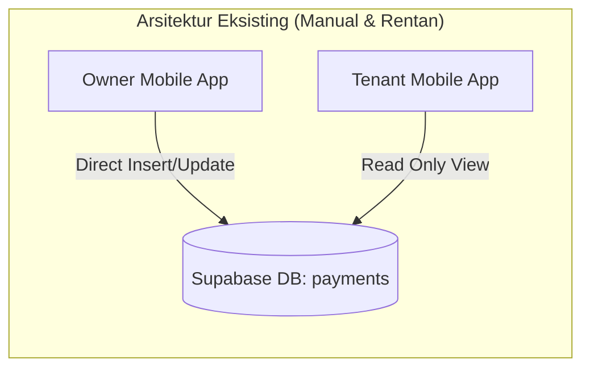
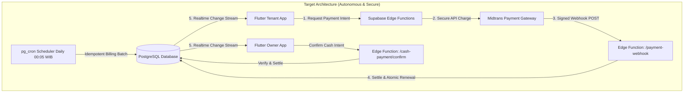
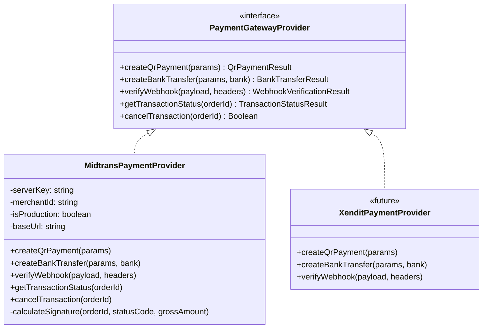
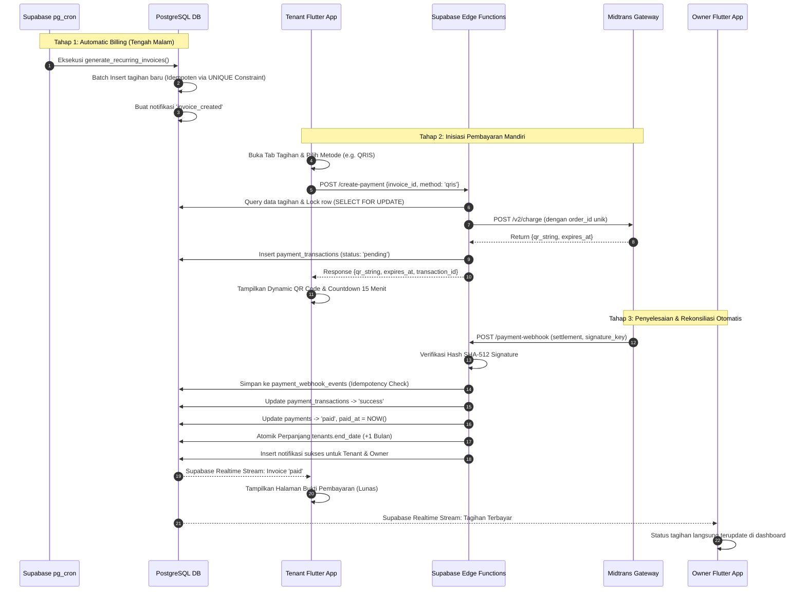
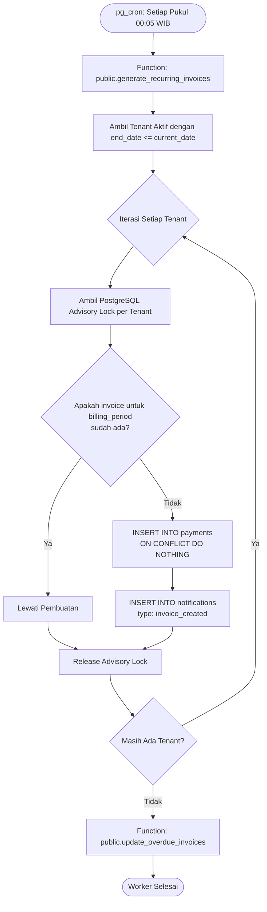
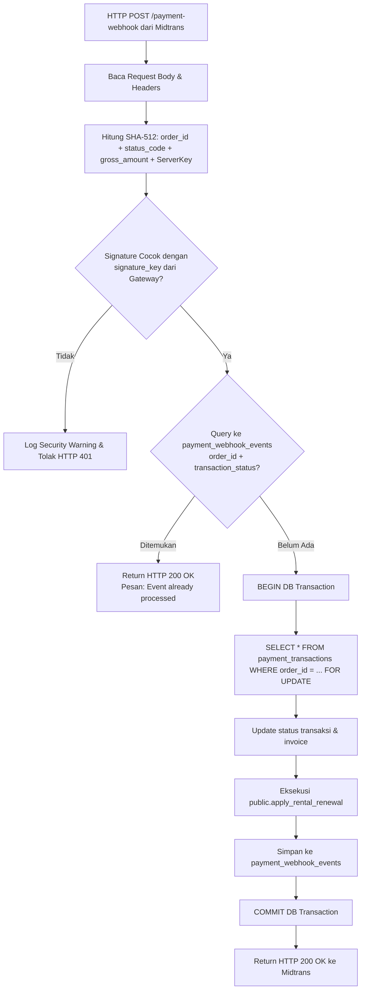

# PAYMENT & AUTOMATIC BILLING SYSTEM ARCHITECTURE
**KosManage Mobile Platform (Flutter Client + Supabase Cloud + Midtrans Payment Gateway)**

- **Module:** Payment & Automatic Billing Architecture
- **Version:** 1.0.0
- **Status:** Approved Architecture Design
- **Path:** `docs/payments/PAYMENT-ARCHITECTURE.md`

---

## 1. Executive Summary

Dokumen ini mendefinisikan arsitektur menyeluruh sistem penagihan otomatis (*automatic billing*) dan pembayaran multi-channel (*multi-channel payment processing*) untuk KosManage Mobile. Arsitektur ini dirancang untuk mengubah model pencatatan pembayaran manual saat ini menjadi sistem otomatis berskala enterprise dengan integritas finansial tinggi (*high financial integrity*), idempotensi ketat, pemisahan tanggung jawab yang jelas (*separation of concerns*), dan tanpa celah keamanan (*zero trust client architecture*).

---

## 2. Existing vs Target Architecture

### 2.1 Existing Architecture (Baseline Analysis)
Pada arsitektur saat ini (MVP v3.0):
1. **Pencatatan Manual:** Pemilik kos mencatat tagihan dan pembayaran melalui `OwnerPaymentsRepository` langsung ke tabel `payments`.
2. **Tenant Read-Only:** Tenant hanya dapat melihat tagihan (`getMyPayments`) di `tenant_shell_page.dart` dengan status *read-only*. Tenant tidak dapat melakukan inisiasi pembayaran mandiri di dalam aplikasi.
3. **Flat Payment Entity:** Tabel `payments` menggabungkan konsep *kewajiban tagihan (invoice)* dan *percobaan pembayaran (payment attempt)* dalam satu baris, sehingga percobaan berulang (*retry*) atau perubahan metode bayar akan menimpa data sebelumnya.
4. **No Server Scheduler:** Pembuatan tagihan mengandalkan input manual dari owner; tidak ada proses latar belakang (*background worker*) yang otomatis menagih ketika masa sewa tenant berakhir.
5. **No Verification Gateway:** Tidak ada payment gateway; konfirmasi pembayaran hanya berbasis rasa percaya atau pengecekan mutasi manual oleh pemilik.



### 2.2 Target Architecture (Self-Driving Property Platform)
Pada target arsitektur baru:
1. **Otonom di Server:** Supabase `pg_cron` secara berkala mendeteksi masa sewa dan menerbitkan tagihan secara idempoten tanpa intervensi pengguna.
2. **Pemisahan Entitas:** Tabel `payments` berfungsi sebagai *Canonical Invoice*, sementara tabel baru `payment_transactions` menampung riwayat $1:N$ upaya pembayaran (QRIS, VA, Tunai).
3. **Payment Gateway Abstraction:** Terhubung ke Midtrans Core API melalui Supabase Edge Functions berkeamanan tinggi dengan antarmuka yang siap diganti ke vendor lain di masa depan.
4. **Verifikasi Webhook Otoritatif:** Perubahan status transaksi dan perpanjangan masa sewa (*rental renewal*) hanya terjadi setelah webhook gateway tervalidasi secara kriptografis (SHA-512) di server backend.
5. **Isolasi RLS Penuh:** Akses data dibatasi oleh Supabase Row Level Security; token server tidak pernah dipasang pada aplikasi Flutter.



---

## 3. Flutter Client Architecture

Arsitektur aplikasi mobile Flutter mengikuti pola **Layered Feature-Driven Architecture** yang selaras dengan panduan `ARCHITECTURE.md` KosManage:

```text
lib/features/payments/ (atau lib/features/tenant/payments & lib/features/owner/payments)
├── presentation/
│   ├── controllers/         # Riverpod AsyncNotifier untuk manajemen state transaksi
│   ├── screens/             # Halaman: InvoiceDetail, PaymentMethodSelect, QrisActive, VaActive, CashActive, ReceiptScreen
│   └── widgets/             # Widget: ActiveBillHeroCard, CountdownTimer, CopyVaBox, PaymentStatusBadge
├── application/
│   └── payment_service.dart # Logika orkestrasi sisi aplikasi (polling fallback, intent formatting)
├── domain/
│   ├── models/              # Immutable Dart models: Invoice, PaymentTransaction, QrisData, VirtualAccountData
│   └── services/            # Pure logic: formatters, status labels, countdown calculators
└── data/
    └── repositories/        # PaymentsRepository (komunikasi via Supabase SDK dan Edge Functions)
```

### 3.1 Prinsip Tanggung Jawab Flutter Client
1. **Presentation & Interaction Only:** Flutter bertanggung jawab merender antarmuka pengguna, menampilkan QR Code, menyalin nomor Virtual Account, dan mengelola timer hitung mundur (*countdown*).
2. **No Secret In Client:** Flutter **TIDAK PERNAH** memuat `MIDTRANS_SERVER_KEY` atau `SUPABASE_SERVICE_ROLE_KEY`. Client hanya berinteraksi menggunakan `anon_key` dan Supabase User JWT.
3. **No Amount Manipulation:** Flutter dilarang mengirimkan nominal uang ke backend. Flutter hanya mengirimkan `invoice_id` dan `payment_method`.
4. **Optimistic UI vs Authoritative State:** UI dapat menampilkan status *loading*, namun status pembayaran `paid` hanya boleh diaktifkan jika server telah menyatakannya melalui respons resmi atau stream Supabase Realtime.

---

## 4. Supabase Cloud Architecture

Supabase berfungsi sebagai *backend cloud platform* tunggal yang menyediakan layanan terintegrasi:

```mermaid
flowchart TD
    subgraph Supabase_Cloud["Supabase Managed Cloud"]
        Auth[Supabase Auth\n(JWT Provider)]
        Postgres[(PostgreSQL Engine\nRLS + Triggers + Functions)]
        Storage[Supabase Storage\n(Payment Receipts / Proof)]
        Realtime[Supabase Realtime\n(Change Data Capture)]
        Edge[Supabase Edge Functions\n(Deno / TypeScript Runtime)]
        PgCron[pg_cron Extension\n(Cron Scheduler Engine)]
    end

    Auth -->|User Context| Edge
    Edge -->|Service Role Operations| Postgres
    PgCron -->|Nightly Automated Jobs| Postgres
    Postgres -->|Listen/Notify CDC| Realtime
    Postgres -->|Storage Security Policies| Storage
```

1. **PostgreSQL Database:** Menyimpan data secara ACID, menerapkan validasi relasi, trigger status otomatis, dan aturan keamanan baris (RLS).
2. **pg_cron Engine:** Ekstensi PostgreSQL untuk menjalankan tugas penagihan harian secara terjadwal pada level basis data.
3. **Edge Functions (Deno Runtime):** Menangani integrasi ke payment gateway, pemrosesan webhook publik, dan logika orkestrasi yang membutuhkan kredensial rahasia (*service role*).
4. **Supabase Realtime:** Memancarkan event perubahan baris tabel (`payments`, `payment_transactions`) langsung ke aplikasi mobile Flutter melalui WebSocket tanpa perlu *polling* manual yang boros daya baterai.

---

## 5. Edge Function Architecture

Edge Functions diisolasi menjadi micro-endpoints menggunakan TypeScript pada Deno runtime:

```text
supabase/functions/
├── _shared/
│   ├── supabase-admin.ts    # Inisialisasi Supabase Client dengan Service Role Key
│   ├── payment-provider.ts  # Abstraction Interface Gateway (PaymentGatewayProvider)
│   ├── midtrans-provider.ts # Implementasi konkret Midtrans API v2 & signature checker
│   └── response-helper.ts   # Standarisasi JSON Response & Error Codes
├── create-payment/          # Endpoint inisiasi transaksi (QRIS / VA / Intent)
├── payment-webhook/         # Endpoint publik penerima callback dari Midtrans
├── payment-status/          # Endpoint sinkronisasi status aktif (pull query)
├── cash-payment/            # Endpoint pengajuan bayar tunai oleh tenant
└── cash-payment-confirm/    # Endpoint persetujuan bayar tunai oleh owner
```

### 5.1 Komunikasi Antara Edge Function dan Database
- Edge Function menggunakan `SUPABASE_SERVICE_ROLE_KEY` **hanya** untuk melakukan operasi yang tidak dapat dilakukan oleh hak akses tenant/owner biasa (misal: verifikasi webhook dari Midtrans atau pencatatan log webhook).
- Sebelum menjalankan mutasi, Edge Function tetap memverifikasi identitas pengguna melalui header `Authorization: Bearer <user_jwt>`.

---

## 6. Payment Gateway Architecture & Midtrans Bridge

Arsitektur gateway dirancang modular menggunakan prinsip *Inversion of Control*:



Keuntungan arsitektur ini:
- Jika di kemudian hari KosManage ingin berpindah atau membagi rute transaksi (*smart routing*) ke Xendit, Doku, atau Faspay, kode pada level business logic dan Flutter tidak perlu diubah.
- Seluruh spesifikasi payload Midtrans (seperti field `qr_string` atau `va_numbers`) dinormalisasi menjadi objek seragam sebelum dikembalikan ke aplikasi Flutter.

---

## 7. End-to-End Data Flow



---

## 8. Server vs Client Responsibility Matrix

| Komponen / Fitur | Tanggung Jawab Flutter Client | Tanggung Jawab Backend (PostgreSQL + Edge Fn) |
|---|---|---|
| **Penentuan Nominal Tagihan** | Menampilkan nominal rupiah berformat. | **Authoritative:** Menghitung `amount_due` dari master sewa kamar. Client dilarang menentukan nominal. |
| **Status Tagihan** | Menampilkan badge status, warna, dan ikon. | **Authoritative:** Menghitung status (`unpaid`, `paid`, `overdue`) via database triggers. |
| **Pembuatan Tagihan Baru** | Tidak ada (atau opsi manual oleh Owner). | **Authoritative:** Dijalankan secara otomatis oleh `pg_cron` cloud worker. |
| **Keamanan Kredensial** | Menyimpan sesi pengguna (Supabase Auth Session). | **Authoritative:** Menyimpan `MIDTRANS_SERVER_KEY` & `SERVICE_ROLE_KEY` secara privat. |
| **Pemilihan Metode Bayar** | Menyediakan radio button / bottom sheet pilihan metode. | Menerima kode metode dan memanggil gateway terkait. |
| **Hitung Mundur Sesi Bayar** | Menjalankan visual ticker per detik di layar. | Menetapkan timestamp `expires_at` yang valid secara absolut. |
| **Perpanjangan Masa Sewa** | Menampilkan tanggal sewa baru setelah refresh. | **Authoritative:** Menjalankan mutasi atomik `tenants.end_date + INTERVAL '1 month'`. |
| **Penyelesaian Transaksi Tunai** | Tenant mengajukan, Owner menekan konfirmasi. | **Authoritative:** Memvalidasi kepemilikan properti dan mengubah status menjadi `paid`. |

---

## 9. Security Boundary & Defense-in-Depth

Arsitektur ini menerapkan strategi pertahanan berlapis (*Defense-in-Depth*):

```text
[ LAPISAN 1: NETWORK & TRANSPORT SECURITY ]
├── Komunikasi HTTPS/TLS 1.3 wajib untuk semua request (Mobile <-> Supabase <-> Gateway).
└── DNS pinning dan validasi URL pada AppConfig Flutter.

[ LAPISAN 2: AUTHENTICATION & ACCESS CONTROL ]
├── Supabase JWT mengotentikasi setiap panggilan API.
└── Row Level Security (RLS) di PostgreSQL mengisolasi data per pengguna secara ketat.

[ LAPISAN 3: SERVER FUNCTION ISOLATION ]
├── Kredensial gateway hanya berada di memory Deno Edge Functions.
└── Public Webhook Endpoint memverifikasi Signature SHA-512 sebelum menyentuh data.

[ LAPISAN 4: DATABASE INTEGRITY & IDEMPOTENCY ]
├── Unique Constraints mencegah invoice dan transaksi duplikat.
├── Table payment_webhook_events mencegah serangan replay attack.
└── Database Trigger mencegah eskalasi role profil secara ilegal.
```

---

## 10. Automatic Billing Worker Architecture

Sistem penagihan otomatis beroperasi di level basis data menggunakan ekstensi `pg_cron`:



- **Ketahanan Terhadap Server Restart:** Karena dieksekusi di database cloud Supabase, siklus penagihan tidak akan terputus meskipun aplikasi mobile pengguna sedang offline atau tidak dibuka selama berbulan-bulan.
- **Isolasi Mutasi:** Jika terjadi kegagalan pada satu tenant (misal format kamar korup), transaksi database menggunakan blok exception terisolasi sehingga tenant lain tetap terproses dengan sukses.

---

## 11. Webhook Engine & Replay Protection

Webhook dari payment gateway diproses dengan standar keamanan finansial tertinggi:



- **HTTP 200 Fast Acknowledgment:** Webhook selalu membalas HTTP 200 ke Midtrans jika signature valid, bahkan ketika event duplikat terdeteksi, untuk mencegah Midtrans melakukan retry berulang yang tidak perlu.
- **Pencatatan Lengkap:** Kolom `raw_payload` pada `payment_webhook_events` menyimpan seluruh body JSON untuk keperluan audit rekonsiliasi dan investigasi sengketa finansial.

---

## 12. Notification Subsystem Architecture

Sub-sistem notifikasi menyatukan tiga saluran komunikasi dalam satu alur terorkestrasi:

```mermaid
flowchart LR
    Event[Event Sistem\ne.g. invoice_created, payment_success] --> DB_Trigger[Trigger Database]
    DB_Trigger --> InsertNotif[Insert ke tabel notifications]
    
    InsertNotif --> InApp[In-App Notification Center\n(Query via Supabase RLS)]
    InsertNotif --> RealtimeStream[Supabase Realtime WebSocket\n(Instant Snackbar & Sound)]
    InsertNotif --> PushEngine[Push Notification Worker\n(Firebase Cloud Messaging via device_tokens)]
    
    InApp --> FlutterApp[Tenant / Owner Mobile App]
    RealtimeStream --> FlutterApp
    PushEngine --> FlutterApp
```

- **Tabel `notifications`:** Menjadi *single source of truth* untuk seluruh pemberitahuan riwayat akun.
- **Deep Linking Support:** Setiap baris notifikasi memiliki kolom `data` JSON yang memuat rute navigasi aplikasi (contoh: `/tenant/payments?id=uuid`), sehingga menekan notifikasi akan langsung membuka tagihan yang bersangkutan.

---

## 13. Rental Renewal Subsystem Architecture

Perpanjangan sewa dirancang dengan prinsip **Atomicity & Immutability**:

1. **Audit Record Abadi (`rental_renewals`):** Setiap penambahan masa sewa menghasilkan baris permanen yang mencatat `previous_end_date`, `new_end_date`, dan `payment_id` yang menjadi dasarnya.
2. **Kunci Penanda Transaksi (`payments.renewal_applied_at`):** Nilai timestamp ini diisi tepat saat perpanjangan diaplikasikan. 
3. **Pencegahan Double Renewal:**
   Pembaruan sewa dibungkus dalam kueri berkondisi ketat:
   ```sql
   UPDATE public.payments 
   SET renewal_applied_at = NOW() 
   WHERE id = p_payment_id 
     AND renewal_applied_at IS NULL 
   RETURNING tenant_id;
   ```
   Jika hasil query bernilai kosong (karena `renewal_applied_at` sudah terisi sebelumnya), maka perintah perpanjangan kamar tidak akan dijalankan lagi.

---

## 14. Architecture Review & Verification

Arsitektur ini telah diverifikasi kompatibel dengan:
- **Flutter Framework:** Mendukung penuh state management Riverpod dan deklarasi rute GoRouter.
- **Material 3 Design:** Mendukung tampilan dark/light mode dan adaptif untuk perangkat smartphone (termasuk referensi QA Xiaomi 15T Pro).
- **PostgreSQL RLS:** Tidak ada bypass RLS atau penggunaan privilege berbahaya di sisi aplikasi mobile.
- **Existing Codebase:** Modul pembayaran lama tetap berfungsi dan secara bertahap diperkaya oleh tabel transaksi baru tanpa pemutusan layanan (*zero downtime migration*).
