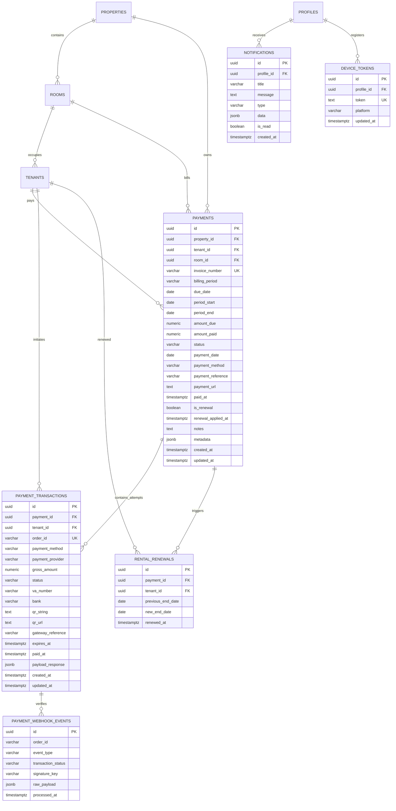

# DATABASE SCHEMA & MIGRATION SPECIFICATION: PAYMENTS & BILLING
**KosManage Mobile Platform (PostgreSQL Relational Schema, Constraints, Indexes, and RLS)**

- **Module:** Payment & Billing Database Architecture
- **Version:** 1.0.0
- **Status:** Approved Database Specification
- **Path:** `docs/payments/PAYMENT-DATABASE.md`

---

## 1. Architectural Database Decision & Rationale

### 1.1 Evaluasi Skema Eksisting vs Entitas Baru
Dalam arsitektur basis data relasional KosManage saat ini, tabel `payments` telah digunakan oleh seluruh modul owner (Dashboard, Kamar, Pembayaran, Laporan Keuangan, dan kalkulator agregasi).

| Opsi Arsitektur | Kelebihan | Kelemahan | Keputusan |
|---|---|---|---|
| **Opsi A: Mengganti total tabel `payments` dengan `billing_invoices` baru** | Desain tabel bersih dari nol. | **Breaking Changes Masif:** Merusak puluhan query di aplikasi owner, merusak riwayat transaksi eksisting, membutuhkan migrasi data destruktif. | **DITOLAK** |
| **Opsi B: Hanya memperluas tabel `payments` tanpa tabel anak** | Tidak membuat tabel baru. | **Audit Trail Hilang:** Tidak bisa menyimpan multiple attempts (misal tenant coba QRIS lalu beralih ke VA). Data transaksi sebelumnya tertimpa. | **DITOLAK** |
| **Opsi C (Hybrid Relational Extension):**<br>1. Mempertahankan `payments` sebagai *Canonical Invoice*.<br>2. Membuat tabel anak `payment_transactions` ($1:N$).<br>3. Menambahkan tabel audit `payment_webhook_events`, `rental_renewals`, `notifications`. | **Zero Breaking Changes:** 100% kode owner & laporan tetap berfungsi.<br>**Audit Trail Penuh:** Mendukung pergantian metode, retry, rekonsiliasi gateway, dan multi-attempt history. | **DISETUJUI (REKOMENDASI ARSITEKTUR)** |

---

## 2. Entity Relationship Diagram (ERD)



---

## 3. Detailed Table Specifications

### 3.1 Tabel `payments` (Canonical Invoice)
- **Tujuan:** Menyimpan data induk kewajiban tagihan sewa bulanan kos.

| Nama Kolom | Tipe Data | Nullable | Default | Keterangan & Aturan |
|---|---|---|---|---|
| `id` | `UUID` | NOT NULL | `gen_random_uuid()` | Primary Key |
| `property_id` | `UUID` | NOT NULL | - | FK ke `properties(id)` |
| `tenant_id` | `UUID` | NOT NULL | - | FK ke `tenants(id)` |
| `room_id` | `UUID` | NULL | - | FK ke `rooms(id)` |
| `invoice_number` | `VARCHAR(64)` | NULL | - | Nomor unik invoice (contoh: `INV/202611/KM-001`) |
| `billing_period` | `VARCHAR(20)` | NOT NULL | - | Format periode standar: `YYYY-MM` (contoh: `2026-11`) |
| `period_start` | `DATE` | NULL | - | Tanggal awal hak sewa periode ini |
| `period_end` | `DATE` | NULL | - | Tanggal akhir hak sewa periode ini |
| `due_date` | `DATE` | NOT NULL | - | Tanggal batas akhir pembayaran |
| `grace_period_days`| `INTEGER` | NOT NULL | `3` | Toleransi hari sebelum status berubah overdue |
| `amount_due` | `NUMERIC(12,2)` | NOT NULL | - | Nominal tagihan resmi |
| `amount_paid` | `NUMERIC(12,2)` | NOT NULL | `0` | Akumulasi nominal yang telah dibayar |
| `status` | `VARCHAR(20)` | NOT NULL | `'unpaid'` | Status: `unpaid`, `partial`, `paid`, `overdue`, `cancelled`, `expired` |
| `payment_date` | `DATE` | NULL | - | Tanggal pembayaran terakhir |
| `payment_method` | `VARCHAR(30)` | NULL | - | Metode terakhir: `qris`, `bank_transfer`, `cash` |
| `payment_reference`| `VARCHAR(100)`| NULL | - | Referensi transaksi sukses |
| `payment_url` | `TEXT` | NULL | - | URL pembayaran / receipt jika ada |
| `paid_at` | `TIMESTAMPTZ` | NULL | - | Waktu pelunasan |
| `is_renewal` | `BOOLEAN` | NOT NULL | `true` | Apakah pelunasan memicu perpanjangan sewa otomatis |
| `renewal_applied_at`| `TIMESTAMPTZ`| NULL | - | Kunci proteksi: timestamp saat sewa berhasil diperpanjang |
| `notes` | `TEXT` | NULL | - | Catatan tagihan / pembatalan |
| `metadata` | `JSONB` | NOT NULL | `'{}'::jsonb` | Metadata tambahan |
| `created_at` | `TIMESTAMPTZ` | NOT NULL | `NOW()` | Waktu penerbitan |
| `updated_at` | `TIMESTAMPTZ` | NOT NULL | `NOW()` | Waktu update terakhir |

- **Constraints & Indexes:**
  - `CONSTRAINT uq_payments_tenant_billing_period UNIQUE (tenant_id, billing_period)`: Menjamin tidak ada pembuatan invoice ganda untuk periode yang sama.
  - `CHECK (amount_due >= 0)` & `CHECK (amount_paid >= 0)`.
  - `INDEX idx_payments_property_due (property_id, due_date DESC)`.
  - `INDEX idx_payments_tenant_status (tenant_id, status)`.

---

### 3.2 Tabel `payment_transactions` (Upaya Sesi Pembayaran)
- **Tujuan:** Mencatat setiap percobaan transaksi pembayaran yang diinisiasi oleh tenant (QRIS, VA, Tunai).

| Nama Kolom | Tipe Data | Nullable | Default | Keterangan & Aturan |
|---|---|---|---|---|
| `id` | `UUID` | NOT NULL | `gen_random_uuid()` | Primary Key |
| `payment_id` | `UUID` | NOT NULL | - | FK ke `payments(id)` ON DELETE CASCADE |
| `tenant_id` | `UUID` | NOT NULL | - | FK ke `tenants(id)` ON DELETE CASCADE |
| `order_id` | `VARCHAR(100)` | NOT NULL | - | Order ID unik gateway (contoh: `KM-INV123-TX1`) |
| `payment_method` | `VARCHAR(30)` | NOT NULL | - | `'qris'`, `'bank_transfer'`, `'cash'` |
| `payment_provider` | `VARCHAR(30)` | NOT NULL | `'midtrans'` | Vendor: `'midtrans'`, `'manual_cash'` |
| `gross_amount` | `NUMERIC(12,2)` | NOT NULL | - | Nominal transaksi yang ditagihkan |
| `status` | `VARCHAR(30)` | NOT NULL | `'created'` | `'created'`, `'pending'`, `'success'`, `'failed'`, `'expired'`, `'cancelled'`, `'waiting_confirmation'` |
| `va_number` | `VARCHAR(50)` | NULL | - | Nomor Virtual Account dari gateway |
| `bank` | `VARCHAR(20)` | NULL | - | Kode bank: `'bca'`, `'bni'`, `'bri'`, `'mandiri'`, `'permata'` |
| `qr_string` | `TEXT` | NULL | - | String payload EMVCo untuk merender QRIS lokal |
| `qr_url` | `TEXT` | NULL | - | URL gambar QR Code dari gateway |
| `gateway_reference`| `VARCHAR(100)`| NULL | - | ID transaksi resmi dari Midtrans (`transaction_id`) |
| `expires_at` | `TIMESTAMPTZ` | NULL | - | Batas waktu kedaluwarsa sesi |
| `paid_at` | `TIMESTAMPTZ` | NULL | - | Waktu pembayaran terverifikasi |
| `payload_response` | `JSONB` | NOT NULL | `'{}'::jsonb` | Raw response payload dari charge API gateway |
| `created_at` | `TIMESTAMPTZ` | NOT NULL | `NOW()` | Waktu pembuatan transaksi |
| `updated_at` | `TIMESTAMPTZ` | NOT NULL | `NOW()` | Waktu pembaruan status |

- **Constraints & Indexes:**
  - `CONSTRAINT uq_payment_transactions_order_id UNIQUE (order_id)`.
  - `INDEX idx_payment_tx_payment (payment_id)`.
  - `INDEX idx_payment_tx_tenant (tenant_id)`.
  - `INDEX idx_payment_tx_order (order_id)`.

---

### 3.3 Tabel `payment_webhook_events` (Idempotensi Webhook)
- **Tujuan:** Log audit penerimaan webhook dari payment gateway untuk mencegah *double settlement* dan *replay attack*.

| Nama Kolom | Tipe Data | Nullable | Default | Keterangan |
|---|---|---|---|---|
| `id` | `UUID` | NOT NULL | `gen_random_uuid()` | Primary Key |
| `order_id` | `VARCHAR(100)` | NOT NULL | - | Referensi order ID transaksi |
| `event_type` | `VARCHAR(50)` | NOT NULL | - | Jenis event (contoh: `payment.settlement`) |
| `transaction_status`| `VARCHAR(50)` | NOT NULL | - | Status transaksi yang dilaporkan gateway |
| `signature_key` | `VARCHAR(255)` | NOT NULL | - | Hash SHA-512 verifikasi tanda tangan |
| `raw_payload` | `JSONB` | NOT NULL | - | Payload JSON lengkap yang diterima |
| `processed_at` | `TIMESTAMPTZ` | NOT NULL | `NOW()` | Waktu penerimaan dan pemrosesan |

- **Constraints:**
  - `CONSTRAINT uq_webhook_event_order_status UNIQUE (order_id, transaction_status)`.

---

### 3.4 Tabel `rental_renewals` (Audit Trail Perpanjangan Sewa)
- **Tujuan:** Mencatat riwayat audit perpanjangan hak sewa kamar yang tidak dapat dimanipulasi.

| Nama Kolom | Tipe Data | Nullable | Default | Keterangan |
|---|---|---|---|---|
| `id` | `UUID` | NOT NULL | `gen_random_uuid()` | Primary Key |
| `payment_id` | `UUID` | NOT NULL | - | FK ke `payments(id)` |
| `tenant_id` | `UUID` | NOT NULL | - | FK ke `tenants(id)` |
| `previous_end_date`| `DATE` | NOT NULL | - | Tanggal sewa sebelum diperpanjang |
| `new_end_date` | `DATE` | NOT NULL | - | Tanggal sewa baru setelah ditambah 1 bulan |
| `renewed_at` | `TIMESTAMPTZ` | NOT NULL | `NOW()` | Waktu eksekusi mutasi |

---

### 3.5 Tabel `notifications` & `device_tokens`
- **Tujuan:** Menampung notifikasi in-app dan token FCM/APNS untuk push notification.
- **Kolom `notifications`:** `id`, `profile_id`, `title`, `message`, `type`, `data` (JSONB berisi deep link), `is_read`, `created_at`.
- **Kolom `device_tokens`:** `id`, `profile_id`, `token` (UNIQUE), `platform` (`'android'`, `'ios'`), `updated_at`.

---

## 4. Row Level Security (RLS) Implementation

```sql
-- Aktifkan RLS di seluruh tabel baru
ALTER TABLE public.payment_transactions ENABLE ROW LEVEL SECURITY;
ALTER TABLE public.payment_webhook_events ENABLE ROW LEVEL SECURITY;
ALTER TABLE public.rental_renewals ENABLE ROW LEVEL SECURITY;
ALTER TABLE public.notifications ENABLE ROW LEVEL SECURITY;
ALTER TABLE public.device_tokens ENABLE ROW LEVEL SECURITY;

-- 1. POLICIES: payment_transactions
-- Tenant hanya bisa membaca transaksi miliknya sendiri
CREATE POLICY payment_tx_tenant_select ON public.payment_transactions
FOR SELECT TO authenticated
USING (
    EXISTS (
        SELECT 1 FROM public.tenants t
        WHERE t.id = payment_transactions.tenant_id
          AND t.profile_id = auth.uid()
    )
);

-- Owner bisa membaca semua transaksi pada kamar propertinya
CREATE POLICY payment_tx_owner_select ON public.payment_transactions
FOR SELECT TO authenticated
USING (
    EXISTS (
        SELECT 1 FROM public.payments p
        JOIN public.properties prop ON prop.id = p.property_id
        WHERE p.id = payment_transactions.payment_id
          AND prop.owner_id = auth.uid()
    )
);

-- Mutasi (INSERT/UPDATE) pada payment_transactions hanya diizinkan via Edge Function (Service Role)
-- Tidak ada policy INSERT/UPDATE publik untuk klien.

-- 2. POLICIES: payment_webhook_events
-- Hanya service_role yang dapat mengakses dan menulis log webhook
CREATE POLICY webhook_events_service_role_only ON public.payment_webhook_events
FOR ALL TO service_role
USING (true)
WITH CHECK (true);

-- 3. POLICIES: rental_renewals
-- Tenant dapat melihat audit perpanjangannya sendiri
CREATE POLICY renewals_tenant_select ON public.rental_renewals
FOR SELECT TO authenticated
USING (
    EXISTS (
        SELECT 1 FROM public.tenants t
        WHERE t.id = rental_renewals.tenant_id
          AND t.profile_id = auth.uid()
    )
);

-- Owner dapat melihat audit perpanjangan propertinya
CREATE POLICY renewals_owner_select ON public.rental_renewals
FOR SELECT TO authenticated
USING (
    EXISTS (
        SELECT 1 FROM public.payments p
        JOIN public.properties prop ON prop.id = p.property_id
        WHERE p.id = rental_renewals.payment_id
          AND prop.owner_id = auth.uid()
    )
);

-- 4. POLICIES: notifications
CREATE POLICY notif_select_own ON public.notifications
FOR SELECT TO authenticated
USING (profile_id = auth.uid());

CREATE POLICY notif_update_own ON public.notifications
FOR UPDATE TO authenticated
USING (profile_id = auth.uid())
WITH CHECK (profile_id = auth.uid());

-- 5. POLICIES: device_tokens
CREATE POLICY device_tokens_own ON public.device_tokens
FOR ALL TO authenticated
USING (profile_id = auth.uid())
WITH CHECK (profile_id = auth.uid());
```

---

## 5. Stored Procedures & Trigger Definitions

### 5.1 Stored Procedure: `public.generate_recurring_invoices()`
Dijalankan setiap hari oleh `pg_cron` untuk menagih sewa:

```sql
CREATE OR REPLACE FUNCTION public.generate_recurring_invoices()
RETURNS integer
LANGUAGE plpgsql
SECURITY DEFINER
SET search_path = public, pg_temp
AS $$
DECLARE
    v_tenant RECORD;
    v_period VARCHAR(20);
    v_start_date DATE;
    v_end_date DATE;
    v_due_date DATE;
    v_count INTEGER := 0;
BEGIN
    FOR v_tenant IN
        SELECT t.id AS tenant_id, t.property_id, t.room_id, t.rent_price, t.end_date, t.profile_id
        FROM public.tenants t
        WHERE t.status = 'active'
          AND t.end_date <= CURRENT_DATE
    LOOP
        -- Hitung periode berikutnya
        v_start_date := (v_tenant.end_date + INTERVAL '1 day')::date;
        v_end_date := (v_start_date + INTERVAL '1 month' - INTERVAL '1 day')::date;
        v_period := to_char(v_start_date, 'YYYY-MM');
        v_due_date := v_start_date;

        -- Insert idempoten
        INSERT INTO public.payments (
            property_id,
            tenant_id,
            room_id,
            invoice_number,
            billing_period,
            period_start,
            period_end,
            due_date,
            amount_due,
            amount_paid,
            status,
            is_renewal
        )
        VALUES (
            v_tenant.property_id,
            v_tenant.tenant_id,
            v_tenant.room_id,
            'INV/' || to_char(v_start_date, 'YYYYMM') || '/' || substring(v_tenant.tenant_id::text from 1 for 6),
            v_period,
            v_start_date,
            v_end_date,
            v_due_date,
            COALESCE(v_tenant.rent_price, 0),
            0,
            'unpaid',
            true
        )
        ON CONFLICT (tenant_id, billing_period) DO NOTHING;

        IF FOUND THEN
            v_count := v_count + 1;
            -- Buat notifikasi jika profile_id terhubung
            IF v_tenant.profile_id IS NOT NULL THEN
                INSERT INTO public.notifications (
                    profile_id,
                    title,
                    message,
                    type,
                    data
                ) VALUES (
                    v_tenant.profile_id,
                    'Tagihan Sewa Baru Tersedia',
                    'Tagihan sewa kos periode ' || v_period || ' telah terbit. Silakan lakukan pembayaran.',
                    'invoice_created',
                    jsonb_build_object('billing_period', v_period, 'amount_due', v_tenant.rent_price)
                );
            END IF;
        END IF;
    END LOOP;

    RETURN v_count;
END;
$$;
```

### 5.2 Stored Procedure: `public.apply_rental_renewal(p_payment_id UUID)`
Menjamin perpanjangan sewa tepat satu kali (*exactly-once renewal*):

```sql
CREATE OR REPLACE FUNCTION public.apply_rental_renewal(p_payment_id UUID)
RETURNS boolean
LANGUAGE plpgsql
SECURITY DEFINER
SET search_path = public, pg_temp
AS $$
DECLARE
    v_payment RECORD;
    v_tenant RECORD;
    v_old_end_date DATE;
    v_new_end_date DATE;
BEGIN
    -- 1. Kunci baris invoice dan cek apakah sudah pernah diperpanjang
    UPDATE public.payments
    SET renewal_applied_at = NOW()
    WHERE id = p_payment_id
      AND status = 'paid'
      AND is_renewal = true
      AND renewal_applied_at IS NULL
    RETURNING tenant_id INTO v_payment;

    IF NOT FOUND THEN
        -- Perpanjangan sudah diaplikasikan sebelumnya atau bukan tagihan renewal
        RETURN false;
    END IF;

    -- 2. Ambil data tenant aktif
    SELECT id, end_date INTO v_tenant
    FROM public.tenants
    WHERE id = v_payment.tenant_id
      AND status = 'active'
    FOR UPDATE;

    IF NOT FOUND THEN
        RETURN false;
    END IF;

    v_old_end_date := v_tenant.end_date;
    v_new_end_date := (v_old_end_date + INTERVAL '1 month')::date;

    -- 3. Update tanggal masa sewa
    UPDATE public.tenants
    SET end_date = v_new_end_date,
        updated_at = NOW()
    WHERE id = v_tenant.id;

    -- 4. Catat ke tabel audit rental_renewals
    INSERT INTO public.rental_renewals (
        payment_id,
        tenant_id,
        previous_end_date,
        new_end_date
    ) VALUES (
        p_payment_id,
        v_tenant.id,
        v_old_end_date,
        v_new_end_date
    );

    RETURN true;
END;
$$;
```
