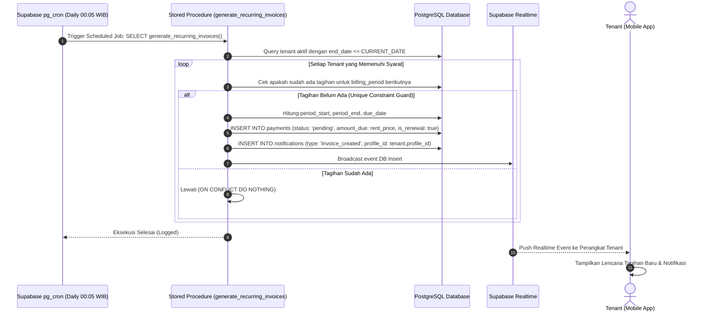
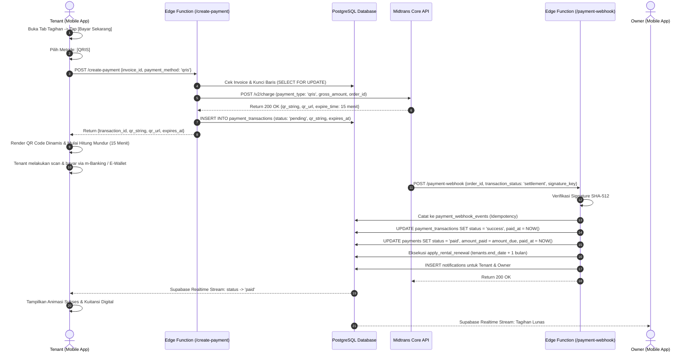
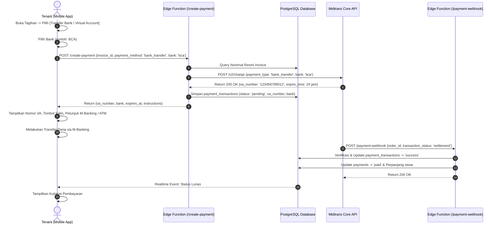
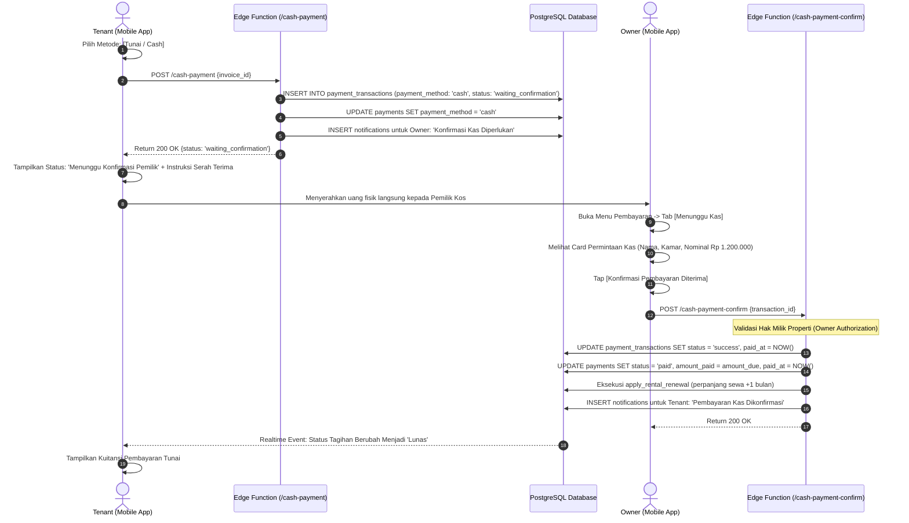
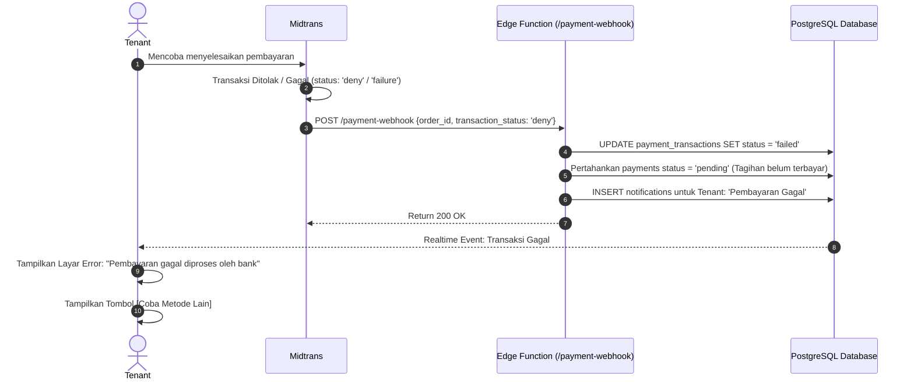
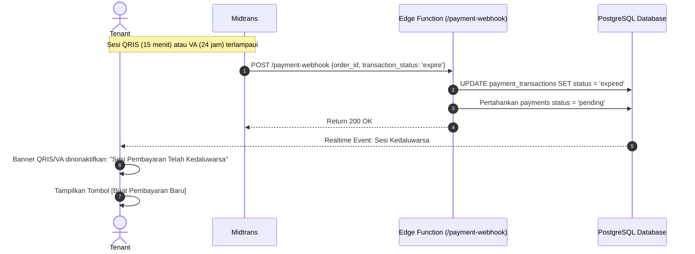
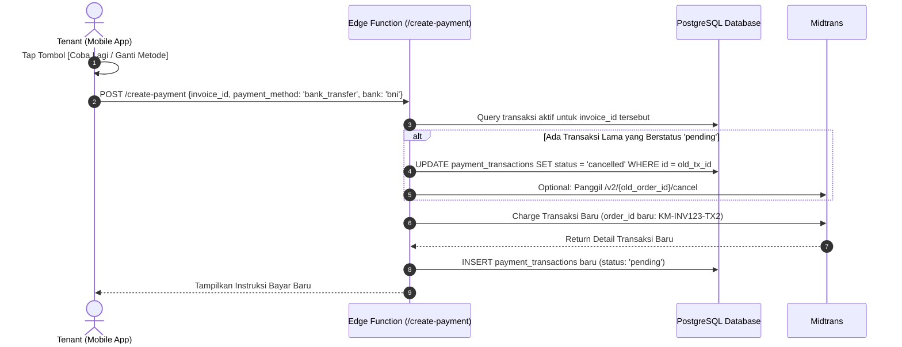
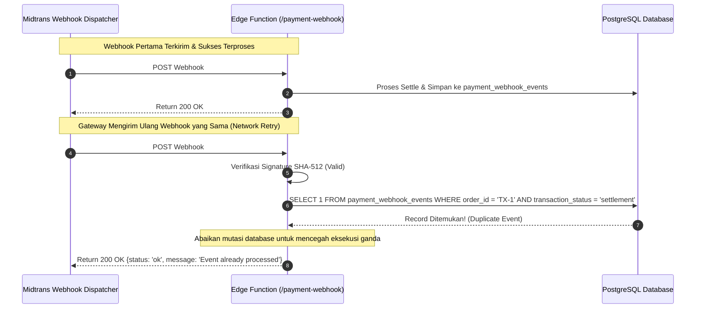
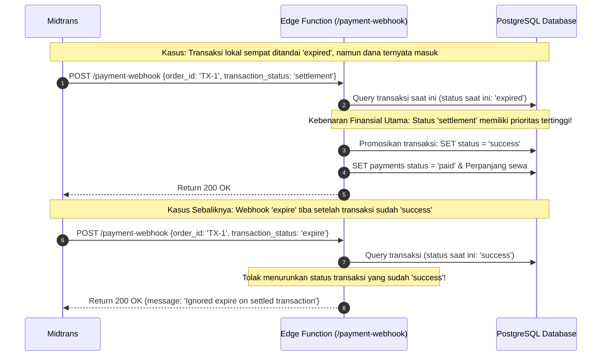
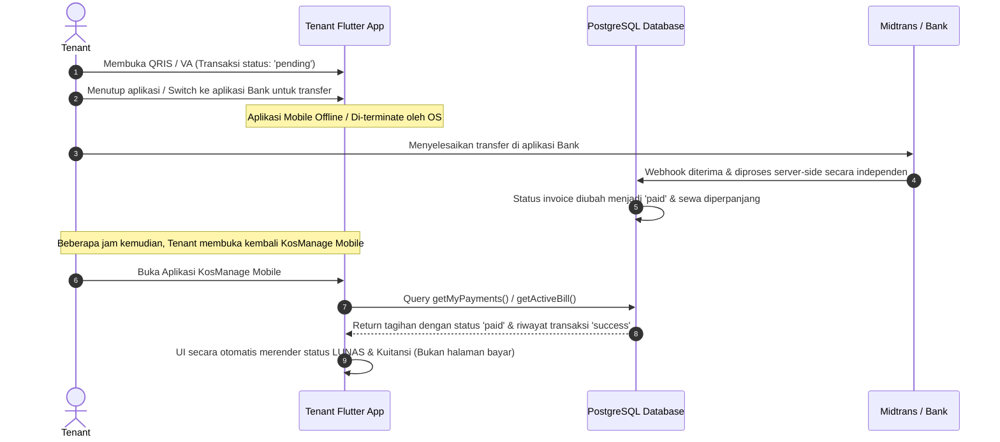

# END-TO-END PAYMENT FLOW SPECIFICATION
**KosManage Mobile Platform (Step-by-Step Sequence Flows & Edge Case Handlers)**

- **Module:** Payment & Billing Operational Flows
- **Version:** 1.0.0
- **Status:** Approved Technical Specification
- **Path:** `docs/payments/PAYMENT-FLOW.md`

---

## 1. Overview

Dokumen ini mendokumentasikan secara rinci 10 (sepuluh) alur kerja (*operational flows*) sistem penagihan otomatis dan pembayaran di KosManage Mobile, mencakup alur normal (*happy path*), penanganan kegagalan (*failure path*), dan penanganan kondisi batas (*edge cases*).

---

## 2. Flow A: Automatic Billing Workflow

Alur pembuatan tagihan otomatis secara terjadwal di level cloud backend (*server-side scheduled billing*).

### Penjelasan Langkah demi Langkah:
1. **Trigger Terjadwal:** Setiap hari pukul 00:05 WIB, `pg_cron` memanggil fungsi `public.generate_recurring_invoices()`.
2. **Identifikasi Tenant:** Sistem menyaring tabel `tenants` dengan kondisi `status = 'active'` dan `end_date <= CURRENT_DATE`.
3. **Pemeriksaan Idempotensi:** Sistem memeriksa apakah kombinasi `(tenant_id, billing_period)` sudah ada di tabel `payments`.
4. **Penerbitan Invoice:** Jika belum ada, sistem menerbitkan record invoice baru dengan nominal `amount_due = rent_price`, `due_date = period_start`, dan status awal `'pending'`.
5. **Notifikasi Otomatis:** Sistem membuat pesan di tabel `notifications` yang memicu push notification ke smartphone tenant.

---

## 3. Flow B: QRIS Dynamic Payment Workflow

Alur pembayaran menggunakan QRIS Dinamis standar EMVCo Nasional (Gopay, OVO, Dana, ShopeePay, BCA, dll).

---

## 4. Flow C: Bank Transfer / Virtual Account Workflow

Alur pembayaran menggunakan nomor rekening Virtual Account bank terkemuka (BCA, BNI, BRI, Mandiri, Permata).

---

## 5. Flow D: Cash Payment Workflow

Alur pembayaran tunai langsung dengan verifikasi aman dua arah (*two-way handshake*).

---

## 6. Flow E: Failed Payment Workflow

Alur ketika transaksi ditolak oleh pihak bank penerbit atau gateway (misal saldo tidak mencukupi atau limit kartu terlampaui).

---

## 7. Flow F: Expired Payment Workflow

Alur ketika batas waktu sesi pembayaran habis sebelum tenant mentransfer dana.

---

## 8. Flow G: Retry Payment Workflow

Alur ketika tenant mencoba kembali setelah transaksi sebelumnya gagal atau kedaluwarsa.

---

## 9. Flow H: Duplicate Webhook Handling Workflow

Alur mitigasi ketika payment gateway mengirimkan payload webhook yang sama lebih dari satu kali karena kendala timeout jaringan.

---

## 10. Flow I: Out-of-Order Webhook Handling Workflow

Alur mitigasi ketika webhook tiba tidak berurutan (misal event `expire` tiba lebih lambat daripada event `settlement`, atau sebaliknya).

---

## 11. Flow J: User Closes App During Payment Workflow

Alur ketika pengguna keluar dari aplikasi, baterai habis, atau koneksi terputus saat transaksi sedang berlangsung.

