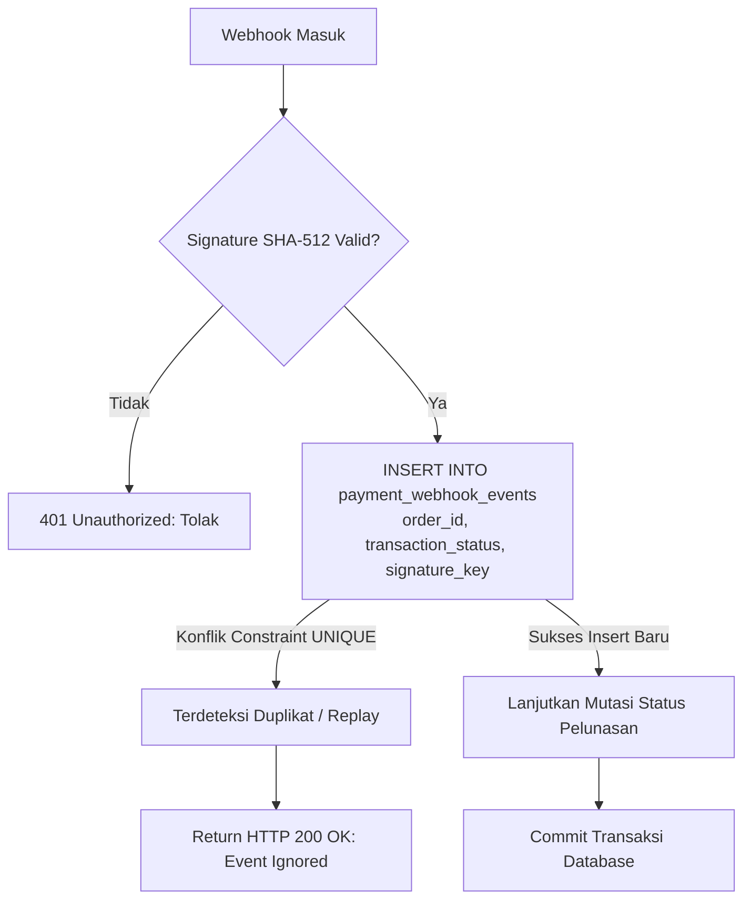

# SECURITY, AUTHORIZATION & CRYPTOGRAPHIC VERIFICATION
**KosManage Mobile Platform (Zero Trust Security, Webhook Signatures, and Threat Modeling)**

- **Module:** Payment Security Architecture
- **Version:** 1.0.0
- **Status:** Approved Security Specification
- **Path:** `docs/payments/PAYMENT-SECURITY.md`

---

## 1. Zero Trust Architectural Baseline

Sistem pembayaran KosManage Mobile dirancang dengan arsitektur **Zero Trust Client**:
1. **Never Trust the Client:** Seluruh input dari aplikasi Flutter (termasuk nominal harga, tanggal jatuh tempo, dan status lunas) dianggap tidak terpercaya (*untrusted input*).
2. **Server Authoritative State:** Sumber kebenaran finansial tunggal hanya berada pada basis data PostgreSQL dan Supabase Edge Functions.
3. **Strict Credential Segregation:** Kredensial rahasia gateway dan kunci dengan hak istimewa (*privileged keys*) **DILARANG KERAS** disimpan di repositori Git, aplikasi Flutter, atau cache perangkat lokal pengguna.

---

## 2. Hard Security Constraints for Flutter Client

```text
================================================================================
                    CRITICAL SECURITY RULE FOR FLUTTER CLIENT
================================================================================
Aplikasi Flutter KosManage Mobile TIDAK BOLEH memuat, menyimpan, atau mengekspos:
  1. MIDTRANS_SERVER_KEY (Private Gateway Key)
  2. SUPABASE_SERVICE_ROLE_KEY (Database Admin Key)
  3. MIDTRANS_MERCHANT_ID (Private Gateway Salt)
  4. Database Connection Strings / Superuser Credentials

Aplikasi Flutter HANYA DIPERBOLEHKAN memuat:
  1. SUPABASE_URL
  2. SUPABASE_ANON_KEY (Public Publishable Key dengan batas RLS)
  3. MIDTRANS_CLIENT_KEY (Public Key untuk rendering token di web/client)
================================================================================
```

Jika seorang penyerang (*attacker*) melakukan dekompilasi terhadap file `.apk` atau `.ipa` aplikasi Flutter, mereka tidak akan menemukan kunci privat apapun yang dapat digunakan untuk membobol sistem atau memalsukan pembayaran.

---

## 3. Data Isolation: Tenant vs Owner (Row Level Security)

Keamanan akses data dijamin secara mendasar oleh mesin PostgreSQL Row Level Security (RLS).

```mermaid
flowchart TD
    User([Pengguna Terotentikasi: auth.uid()]) --> CheckRole{Cek Role di profiles}
    
    CheckRole -- Role: Tenant --> TenantPath[Tenant Isolation Policy]
    TenantPath --> TenantCheck{auth.uid() == tenants.profile_id?}
    TenantCheck -- Ya --> AllowTenant[Izinkan SELECT tagihan & transaksi miliknya]
    TenantCheck -- Tidak --> DenyTenant[Tolak Akses: Empty Set / 0 Rows]
    
    CheckRole -- Role: Owner --> OwnerPath[Owner Isolation Policy]
    OwnerPath --> OwnerCheck{auth.uid() == properties.owner_id?}
    OwnerCheck -- Ya --> AllowOwner[Izinkan SELECT seluruh kamar & tagihan properti miliknya]
    OwnerCheck -- Tidak --> DenyOwner[Tolak Akses: Empty Set / 0 Rows]
```

### 3.1 Tenant Data Isolation Guard
- Tenant hanya dapat membaca data yang terhubung ke dirinya melalui rantai relasi:
  `auth.uid() -> profiles.id -> tenants.profile_id -> payments.tenant_id`.
- Tenant **TIDAK MEMILIKI** izin RLS untuk melakukan perintah SQL `INSERT`, `UPDATE`, atau `DELETE` pada tabel `payments`.
- Kolom sensitif seperti `amount_due`, `amount_paid`, `status`, dan `due_date` tidak dapat diubah oleh tenant melalui API REST Supabase publik.

### 3.2 Owner Data Isolation Guard
- Owner hanya dapat membaca dan mengelola data yang propertinya dimiliki oleh dirinya:
  `auth.uid() -> properties.owner_id -> rooms.property_id -> payments.property_id`.
- Owner A **TIDAK AKAN PERNAH** dapat melihat data kamar, penghuni, atau tagihan milik Owner B (*strict multi-tenant boundary*).

---

## 4. Protection Against Amount Tampering

Salah satu kerentanan paling umum pada aplikasi e-commerce/fintech adalah manipulasi nominal harga oleh klien (*client-side price manipulation*).

### Mekanisme Pencegahan di KosManage:
1. **Client Request Tanpa Field Nominal:**
   Saat tenant menekan tombol "Bayar Sekarang", request yang dikirimkan oleh Flutter ke Edge Function `create-payment` hanya memuat:
   ```json
   {
     "invoice_id": "9b1deb4d-3b7d-4bad-9bdd-2b0d7b3dcb6d",
     "payment_method": "qris"
   }
   ```
   *(Tidak ada parameter `amount`, `price`, atau `gross_amount` yang dikirim dari klien).*
2. **Server-Side Price Lookup:**
   Edge Function secara mandiri melakukan kueri ke basis data PostgreSQL:
   ```sql
   SELECT (amount_due - amount_paid) AS net_due, status 
   FROM public.payments 
   WHERE id = v_invoice_id;
   ```
3. **Validasi Status Tagihan:**
   Jika `status == 'paid'` atau `net_due <= 0`, Edge Function langsung membatalkan request dengan error: `"Tagihan ini telah lunas sebelumnya"`.

---

## 5. Webhook Cryptographic Verification (SHA-512)

Endpoint webhook `/payment-webhook` adalah endpoint publik yang dapat menerima panggilan HTTP POST dari internet. Untuk memastikan bahwa payload benar-benar berasal dari Midtrans dan bukan dari penyerang (*spoofing attack*), sistem memvalidasi tanda tangan kriptografis.

### 5.1 Rumus Perhitungan Tanda Tangan Midtrans
Midtrans menghitung signature menggunakan algoritma **SHA-512** dengan formula:
$$\text{Signature} = \text{SHA512}(\text{order\_id} + \text{status\_code} + \text{gross\_amount} + \text{MIDTRANS\_SERVER\_KEY})$$

### 5.2 Algoritma Verifikasi pada Edge Function (Deno TypeScript)
```typescript
import { crypto } from "https://deno.land/std@0.177.0/crypto/mod.ts";

export async function verifyMidtransSignature(
  orderId: string,
  statusCode: string,
  grossAmount: string,
  serverKey: string,
  receivedSignature: string
): Promise<boolean> {
  const rawString = `${orderId}${statusCode}${grossAmount}${serverKey}`;
  const encoder = new TextEncoder();
  const data = encoder.encode(rawString);
  const hashBuffer = await crypto.subtle.digest("SHA-512", data);
  const hashArray = Array.from(new Uint8Array(hashBuffer));
  const calculatedSignature = hashArray.map(b => b.toString(16).padStart(2, '0')).join('');

  // Timing-safe comparison untuk mencegah timing attack
  return calculatedSignature === receivedSignature;
}
```

Jika tanda tangan tidak cocok persis:
- Request langsung ditolak dengan status **HTTP 401 Unauthorized**.
- Log peringatan keamanan dicatat.
- Database **TIDAK AKAN PERNAH** dimutasi.

---

## 6. Anti-Replay & Duplicate Webhook Protection

Penyerang mungkin mencoba menangkap (*sniffing*) paket webhook sukses yang sah lalu mengirimkannya berulang-ulang ke server (*replay attack*).



- **Database Constraint Guard:**
  Tabel `payment_webhook_events` memiliki constraint unik gabungan:
  `CONSTRAINT uq_webhook_event_order_status UNIQUE (order_id, transaction_status)`
- Jika webhook untuk `order_id` dan `transaction_status` yang sama dikirimkan ulang oleh Midtrans, sistem langsung mendeteksi duplikasi di level basis data, mengabaikan mutasi, dan membalas HTTP 200 secara aman tanpa mengubah apapun.

---

## 7. Protection Against Unauthorized Cash Confirmation

Pembayaran tunai rentan terhadap penipuan jika tenant dapat mengonfirmasi sendiri pembayarannya.

### Aturan Keamanan Konfirmasi Tunai:
1. **Role Guard:** Endpoint `/cash-payment-confirm` hanya dapat dipanggil oleh pengguna yang terdaftar sebagai pemilik (*owner*).
2. **Property Ownership Check:**
   Sistem mengeksekusi kueri verifikasi kepemilikan sebelum mengonfirmasi:
   ```sql
   SELECT prop.owner_id 
   FROM public.payment_transactions tx
   JOIN public.payments p ON p.id = tx.payment_id
   JOIN public.properties prop ON prop.id = p.property_id
   WHERE tx.id = v_transaction_id;
   ```
   Jika `prop.owner_id != auth.uid()`, request langsung dibatalkan dengan respon **HTTP 403 Forbidden: "Anda bukan pemilik sah dari kamar ini"**.

---

## 8. Secrets & Environment Key Management

| Nama Kunci Rahasia | Lokasi Penyimpanan | Izin Akses | Risiko Jika Bocor |
|---|---|---|---|
| `MIDTRANS_SERVER_KEY` | Supabase Vault / Edge Function Secret | Hanya Supabase Edge Function | Penyerang dapat membuat transaksi palsu atau membatalkan pesanan. |
| `SUPABASE_SERVICE_ROLE_KEY` | Supabase Vault / Edge Function Secret | Hanya Supabase Edge Function | Penyerang dapat mem-bypass seluruh RLS dan mengakses seluruh database. |
| `MIDTRANS_CLIENT_KEY` | Edge Function / App Config (Opsional) | Publik | Rendah (hanya digunakan untuk inisialisasi frontend JS jika ada). |
| `SUPABASE_ANON_KEY` | Flutter App (`local.json`) | Publik Terotentikasi | Aman selama RLS aktif dan diuji dengan benar. |

### Prosedur Penyimpanan Kunci Rahasia:
Kunci rahasia diatur menggunakan Supabase CLI langsung ke server cloud:
```bash
supabase secrets set MIDTRANS_SERVER_KEY="SB-Mid-server-xxxxxxxxxxxx"
supabase secrets set MIDTRANS_IS_PRODUCTION="false"
supabase secrets set MIDTRANS_MERCHANT_ID="G123456789"
```
File `local.json` di Flutter **HANYA** boleh berisi `SUPABASE_URL` dan `SUPABASE_ANON_KEY`.

---

## 9. Immutable Financial Audit Trail

Seluruh aktivitas finansial dicatat secara permanen (*append-only logs*):
1. **Audit Upaya Pembayaran:** Setiap perubahan status transaksi disimpan lengkap dengan raw response di `payment_transactions.payload_response`.
2. **Audit Webhook:** Setiap payload webhook disimpan utuh di `payment_webhook_events.raw_payload`.
3. **Audit Perpanjangan Sewa:** Riwayat penambahan tanggal masa sewa disimpan abadi di `rental_renewals` (`previous_end_date` vs `new_end_date`).
4. **Trigger Anti-Hapus:** Dibuat trigger database yang melarang penghapusan (*DELETE*) pada baris transaksi yang telah berstatus `'success'`.
