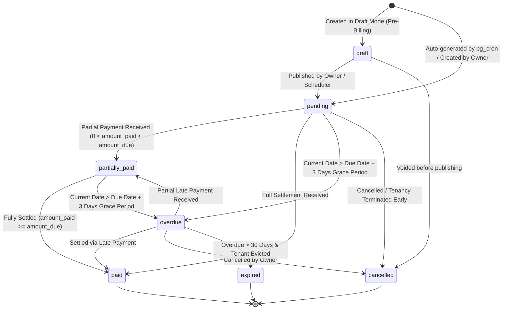
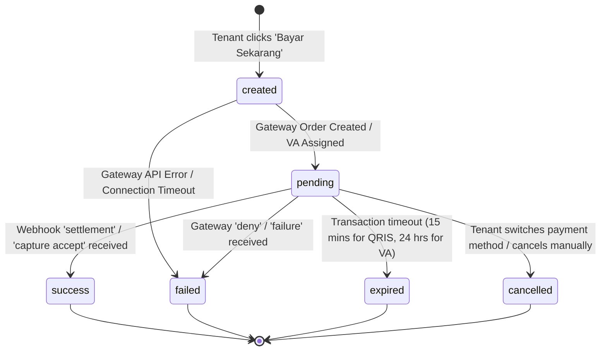
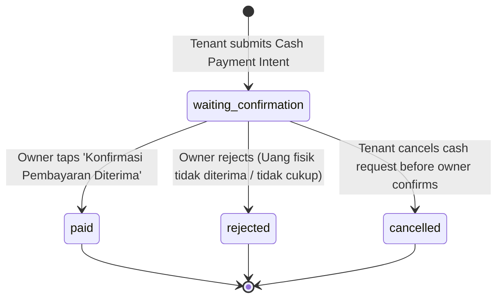

# PAYMENT & INVOICE STATE MACHINE SPECIFICATION
**KosManage Mobile Platform (State Lifecycle, Valid Transitions, and Mutation Rules)**

- **Module:** Payment & Billing State Machines
- **Version:** 1.0.0
- **Status:** Approved Technical Specification
- **Path:** `docs/payments/PAYMENT-STATE-MACHINE.md`

---

## 1. Overview & Architectural Principles

Dokumen ini mendefinisikan secara formal seluruh mesin status (*state machines*) yang mengatur siklus hidup penagihan dan pembayaran di KosManage Mobile. Terdapat 3 (tiga) state machine yang saling terhubung:
1. **Invoice State Machine (`payments.status`)**: Mengelola status kewajiban tagihan sewa kos.
2. **Payment Transaction State Machine (`payment_transactions.status`)**: Mengelola status sesi/upaya transaksi gateway digital (QRIS & Virtual Account).
3. **Cash Payment State Machine (`payment_transactions.status` khusus metode `cash`)**: Mengelola alur verifikasi pembayaran tunai langsung antara penghuni dan pemilik.

### Prinsip Otoritas State Machine
- **Server Authoritative:** Klien Flutter dilarang mengubah status secara langsung. Seluruh perubahan status dimediasi oleh PostgreSQL Trigger, pg_cron worker, atau Supabase Edge Functions.
- **Strict Transition Guards:** Setiap transisi wajib memvalidasi status sebelumnya (*pre-condition*). Transisi dari state yang tidak valid akan memicu *Database Exception* (SQL `RAISE EXCEPTION`) atau HTTP 400.
- **Terminal States Immutability:** State `paid`, `cancelled`, dan `expired` pada transaksi adalah status akhir (*terminal state*) yang tidak dapat diubah kembali ke status aktif.

---

## 2. Invoice State Machine (`payments.status`)

Invoice merepresentasikan kewajiban finansial tenant untuk menempati kamar dalam periode tertentu.



### 2.1 Definisi Lengkap Setiap Status Invoice

#### A. `draft`
- **Arti Bisnis:** Tagihan telah disiapkan oleh sistem atau pemilik kos namun belum dipublikasikan kepada tenant. Tenant belum dapat melihat atau membayar tagihan ini.
- **Siapa yang Dapat Mengubah:** Owner atau Sistem Backend (Admin).
- **Trigger Pemicu:** Owner memilih "Simpan sebagai Draf" saat membuat penagihan masa mendatang.
- **State Sebelumnya yang Valid:** `[*]`.
- **State Berikutnya yang Valid:** `pending`, `cancelled`.
- **Efek Database:** Baris tersimpan di tabel `payments` dengan `status = 'draft'`. RLS policy menyembunyikan tagihan ini dari query tenant (`payments_tenant_select`).
- **Efek Notifikasi:** Tidak ada notifikasi yang dikirimkan.

#### B. `pending` (Ekuivalen dengan `unpaid` pada skema lama)
- **Arti Bisnis:** Tagihan aktif telah dipublikasikan dan wajib dibayar oleh tenant sebelum tanggal jatuh tempo (*due date*).
- **Siapa yang Dapat Mengubah:** Scheduler `pg_cron`, Owner, atau Edge Function (saat mempublikasikan draf).
- **Trigger Pemicu:** Eksekusi otomatis harian `generate_recurring_invoices()` atau penerbitan draf.
- **State Sebelumnya yang Valid:** `draft`, `[*]`.
- **State Berikutnya yang Valid:** `paid`, `partially_paid`, `overdue`, `cancelled`.
- **Efek Database:** Kolom `status = 'pending'`, `amount_due` terkunci, `due_date` ditetapkan.
- **Efek Notifikasi:** Sistem mengirimkan notifikasi event `invoice_created` ke tenant via In-App, Realtime, dan Push Notification.

#### C. `partially_paid` (Ekuivalen dengan `partial` pada skema lama)
- **Arti Bisnis:** Sebagian nominal tagihan telah dibayar oleh tenant, namun masih terdapat sisa saldo terutang (`0 < amount_paid < amount_due`).
- **Siapa yang Dapat Mengubah:** Owner (mencatat cicilan tunai) atau Edge Function (pembayaran bertahap).
- **Trigger Pemicu:** Input pembayaran sebagian dengan `amount_paid < amount_due`.
- **State Sebelumnya yang Valid:** `pending`, `overdue`.
- **State Berikutnya yang Valid:** `paid`, `overdue`.
- **Efek Database:** `amount_paid` bertambah, kolom `status` dihitung otomatis oleh trigger `payments_set_status()` menjadi `'partial'`.
- **Efek Notifikasi:** Notifikasi info pembayaran parsial dikirim ke tenant dengan rincian sisa tagihan.

#### D. `paid`
- **Arti Bisnis:** Tagihan telah lunas sepenuhnya (`amount_paid >= amount_due`). Kewajiban sewa periode tersebut telah selesai.
- **Siapa yang Dapat Mengubah:** Edge Function Webhook Gateway (Midtrans) atau Owner (konfirmasi kas tunai).
- **Trigger Pemicu:** Webhook transaksi sukses dari gateway atau persetujuan pembayaran kas oleh owner.
- **State Sebelumnya yang Valid:** `pending`, `partially_paid`, `overdue`.
- **State Berikutnya yang Valid:** `[*]` (Status Akhir / Terminal State).
- **Efek Database:** 
  1. `status = 'paid'`, `amount_paid = amount_due`, `paid_at = NOW()`.
  2. Memicu eksekusi Stored Procedure `apply_rental_renewal` untuk memperpanjang `tenants.end_date` (+1 bulan).
  3. Mengisi `renewal_applied_at = NOW()`.
- **Efek Notifikasi:** Notifikasi event `payment_success` dikirimkan secara instan ke tenant dan owner.

#### E. `overdue`
- **Arti Bisnis:** Tagihan belum lunas dan telah melewati batas toleransi keterlambatan (*grace period*, default: 3 hari setelah `due_date`).
- **Siapa yang Dapat Mengubah:** Scheduler `pg_cron` (otomatis setiap tengah malam).
- **Trigger Pemicu:** Fungsi `update_overdue_invoices()` mendeteksi `CURRENT_DATE > due_date + grace_period_days` dan `amount_paid < amount_due`.
- **State Sebelumnya yang Valid:** `pending`, `partially_paid`.
- **State Berikutnya yang Valid:** `paid`, `partially_paid`, `expired`, `cancelled`.
- **Efek Database:** `status = 'overdue'`. Badge di aplikasi tenant dan owner berubah menjadi merah dengan tanda seru peringatan.
- **Efek Notifikasi:** Sistem mengirimkan notifikasi event `payment_reminder` berintensitas tinggi (peringatan tunggakan) ke tenant dan rekap tunggakan ke owner.

#### F. `expired`
- **Arti Bisnis:** Tagihan menunggak lebih dari 30 hari dan tenant telah meninggalkan kos tanpa menyelesaikan pelunasan (*bad debt / uncollectible*).
- **Siapa yang Dapat Mengubah:** Owner atau Sistem Pembersihan Berkala.
- **Trigger Pemicu:** Tindakan owner menandai tagihan sebagai piutang tak tertagih saat melakukan proses checkout paksa tenant.
- **State Sebelumnya yang Valid:** `overdue`.
- **State Berikutnya yang Valid:** `[*]` (Terminal State).
- **Efek Database:** `status = 'expired'`. Tagihan dipindahkan ke arsip historis dan tidak lagi muncul di ringkasan piutang aktif dashboard.
- **Efek Notifikasi:** Notifikasi penutupan tagihan dikirim ke owner sebagai bagian dari laporan keuangan tahunan.

#### G. `cancelled`
- **Arti Bisnis:** Tagihan dibatalkan secara resmi karena kesalahan administratif, pergantian kamar di tengah jalan, atau pembatalan kontrak sewa.
- **Siapa yang Dapat Mengubah:** Owner saja.
- **Trigger Pemicu:** Owner memilih aksi "Batalkan Tagihan" dengan menyertakan alasan pembatalan pada kolom `notes`.
- **State Sebelumnya yang Valid:** `draft`, `pending`, `overdue`.
- **State Berikutnya yang Valid:** `[*]` (Terminal State).
- **Efek Database:** `status = 'cancelled'`, kolom `notes` diperbarui dengan alasan pembatalan. Setiap transaksi aktif yang terhubung di `payment_transactions` otomatis ditandai `cancelled`.
- **Efek Notifikasi:** Notifikasi pembatalan tagihan dikirim ke tenant.

---

## 3. Payment Transaction State Machine (`payment_transactions.status`)

Setiap kali tenant memilih metode pembayaran dan menekan "Bayar", sistem membuat satu baris sesi transaksi baru di tabel `payment_transactions`.



### 3.1 Definisi Status Transaksi Gateway

| Status | Arti Bisnis | Pemicu & Aktor | Transisi Sebelumnya | Transisi Berikutnya | Efek Database & Notifikasi |
|---|---|---|---|---|---|
| `created` | Intent transaksi dibuat di server KosManage, sebelum memanggil API gateway. | Edge Function `create-payment` dipanggil oleh Tenant. | `[*]` | `pending`, `failed` | Record dibuat di `payment_transactions` dengan `order_id` unik (misal: `KM-INV123-TX1`). Belum ada notifikasi. |
| `pending` | Gateway berhasil membuat transaksi; QR Code string atau Nomor VA siap dibayar. | Midtrans merespon HTTP 200 dengan payload pembayaran. | `created` | `success`, `failed`, `expired`, `cancelled` | Field `qr_string` / `va_number` dan `expires_at` disimpan di DB. Notifikasi event `payment_pending` dikirim ke tenant. |
| `success` | Pembayaran telah diverifikasi secara sah di bank / e-wallet. | Webhook `settlement` tervalidasi signature-nya di Edge Function. | `pending` | `[*]` | `paid_at = NOW()`. Memicu perubahan status invoice menjadi `paid` dan pembaruan sewa. Notifikasi `payment_success`. |
| `failed` | Transaksi ditolak oleh bank/penerbit (misal saldo tidak cukup, fraud detection). | Webhook `deny` atau `failure` dari Midtrans. | `created`, `pending` | `[*]` | Transaksi ditutup. Invoice tetap `pending`. Tenant dapat mencoba kembali (*retry*). Notifikasi `payment_failed`. |
| `expired` | Batas waktu pembayaran habis (QRIS: 15 menit, VA: 24 jam). | Webhook `expire` dari Midtrans atau evaluasi timer backend. | `pending` | `[*]` | Transaksi kedaluwarsa. Invoice tetap `pending`. UI menampilkan tombol "Buat Transaksi Baru". |
| `cancelled` | Dibatalkan karena tenant memilih metode lain atau membatalkan sesi. | Tenant memilih metode bayar lain saat masih ada transaksi pending. | `pending` | `[*]` | Status transaksi lama diset `cancelled` agar tidak terjadi tumpang tindih instruksi bayar. |

---

## 4. Cash Payment State Machine

Metode tunai (*Cash*) memiliki alur verifikasi khusus dua arah (*two-way handshake*) antara penghuni dan pemilik kos.



### 4.1 Definisi Status Transaksi Kas

#### A. `waiting_confirmation`
- **Arti Bisnis:** Tenant menyatakan telah atau akan menyerahkan uang tunai fisik kepada pemilik kos.
- **Siapa yang Dapat Mengubah:** Tenant (melalui Edge Function `cash-payment`).
- **Trigger Pemicu:** Tenant memilih metode "Cash" dan menekan tombol "Ajukan Pembayaran Tunai".
- **State Sebelumnya yang Valid:** `[*]`.
- **State Berikutnya yang Valid:** `paid`, `rejected`, `cancelled`.
- **Efek Database:** 
  - Record dibuat di `payment_transactions` dengan `payment_method = 'cash'`, `payment_provider = 'manual_cash'`, `status = 'waiting_confirmation'`.
  - Tabel `payments` mencatat `payment_method = 'cash'`.
- **Efek Notifikasi:**
  - Tenant melihat status *"Menunggu Konfirmasi Pemilik"*.
  - Owner menerima notifikasi event `cash_confirmation_required` berisi nama penghuni, kamar, dan nominal uang tunai yang harus dicek.

#### B. `paid`
- **Arti Bisnis:** Pemilik kos telah memeriksa uang fisik, menghitung jumlahnya, dan mengonfirmasi penerimaan secara sah di aplikasi.
- **Siapa yang Dapat Mengubah:** Owner yang memiliki properti kamar tersebut (via Edge Function `cash-payment-confirm`). Tenant dilarang mengonfirmasi status ini.
- **Trigger Pemicu:** Owner menekan tombol "Konfirmasi Pembayaran Diterima" pada dialog konfirmasi di aplikasi.
- **State Sebelumnya yang Valid:** `waiting_confirmation`.
- **State Berikutnya yang Valid:** `[*]` (Terminal State).
- **Efek Database:**
  - Status transaksi `payment_transactions` berubah menjadi `'success'` (atau `'paid'`).
  - Invoice `payments` berubah menjadi `'paid'`, `amount_paid = amount_due`, `paid_at = NOW()`.
  - Memicu penambahan masa sewa tenant secara atomik (+1 bulan).
- **Efek Notifikasi:**
  - Tenant menerima notifikasi event `cash_payment_confirmed`.
  - Riwayat kas tercatat di laporan keuangan pemilik kos.

#### C. `rejected`
- **Arti Bisnis:** Pemilik kos menolak pengajuan pembayaran tunai (misal: uang fisik ternyata belum diserahkan atau nominal tidak sesuai).
- **Siapa yang Dapat Mengubah:** Owner.
- **Trigger Pemicu:** Owner menekan tombol "Tolak Pengajuan Tunai" dan menyertakan alasan.
- **State Sebelumnya yang Valid:** `waiting_confirmation`.
- **State Berikutnya yang Valid:** `[*]` (Terminal State).
- **Efek Database:** Record transaksi ditandai `rejected`. Invoice `payments` kembali ke status `pending` (atau `unpaid`).
- **Efek Notifikasi:** Tenant menerima notifikasi peringatan bahwa pembayaran tunai ditolak beserta alasan dari pemilik.

---

## 5. Hubungan State Machine & Interaksi Lintas Entitas

Tabel berikut merangkum sinkronisasi status antara ketiga mesin status:

| Skenario Alur Pengguna | Status `payments` (Invoice) | Status `payment_transactions` | Masa Sewa `tenants.end_date` |
|---|---|---|---|
| **1. Tagihan baru diterbitkan** | `pending` | *(Belum ada record)* | Tetap pada tanggal lama. |
| **2. Tenant membuka QRIS** | `pending` | `pending` (QRIS) | Tetap. |
| **3. QRIS kedaluwarsa** | `pending` | `expired` | Tetap. |
| **4. Tenant beralih ke Virtual Account** | `pending` | Transaksi 1: `cancelled`<br>Transaksi 2: `pending` (VA) | Tetap. |
| **5. Tenant transfer VA sukses** | `paid` | Transaksi 2: `success` | **Diperpanjang +1 Bulan**. |
| **6. Tenant memilih Cash** | `pending` | Transaksi 3: `waiting_confirmation` | Tetap. |
| **7. Owner konfirmasi Cash** | `paid` | Transaksi 3: `success` | **Diperpanjang +1 Bulan**. |
| **8. Terlambat bayar > 3 hari** | `overdue` | *(Mengikuti sesi bayar aktif)* | Tetap. |
| **9. Bayar saat sudah Overdue** | `paid` | `success` | **Diperpanjang +1 Bulan**. |

---

## 6. Proteksi Terhadap State Inconsistency & Race Conditions

1. **Database Row-Level Lock (`FOR UPDATE`):**
   Setiap eksekusi mutasi status transaksi atau invoice di dalam Edge Function dan Stored Procedure wajib mengunci baris data menggunakan klausul:
   ```sql
   SELECT id, status FROM public.payments WHERE id = v_invoice_id FOR UPDATE;
   ```
   Hal ini mencegah dua webhook yang tiba bersamaan (*concurrent execution*) memproses pelunasan secara ganda.
2. **Idempotency Guard pada Perpanjangan Sewa:**
   Trigger dan fungsi perpanjangan sewa dilindungi oleh kondisi atomik:
   `WHERE id = p_payment_id AND renewal_applied_at IS NULL`
   Sehingga meskipun status transaksi dipanggil ulang, perpanjangan masa sewa dijamin tepat 1 kali (*exactly-once execution*).
